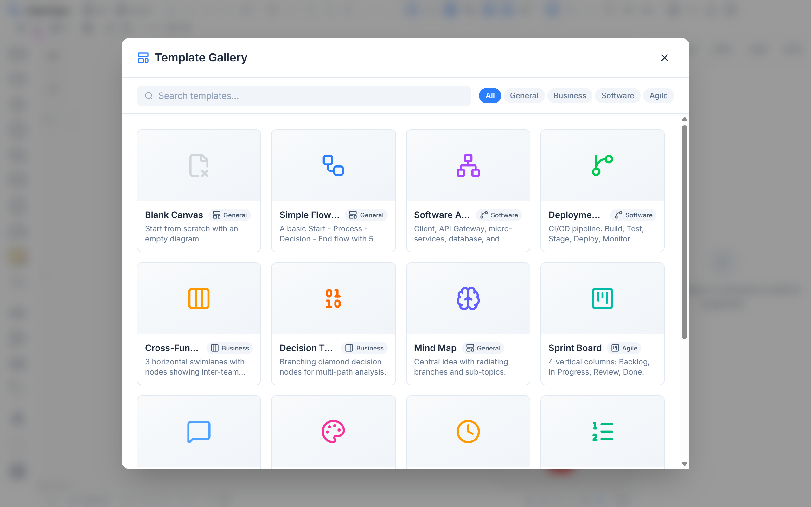
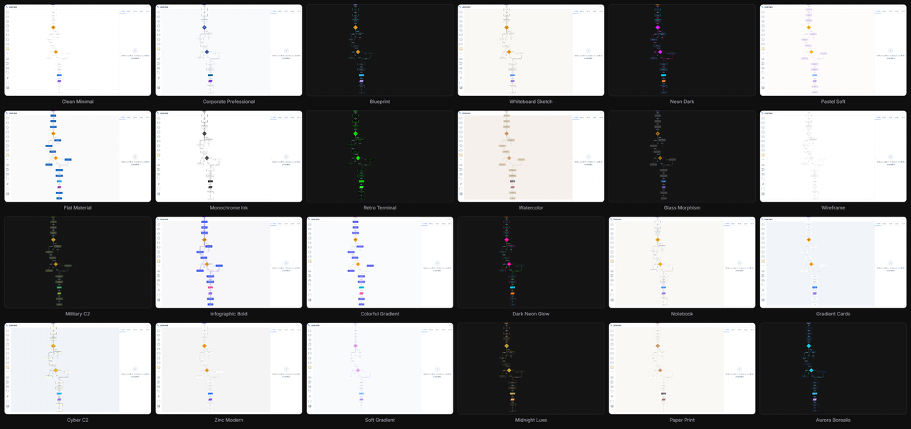
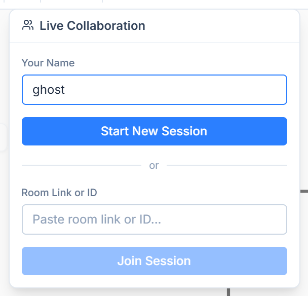
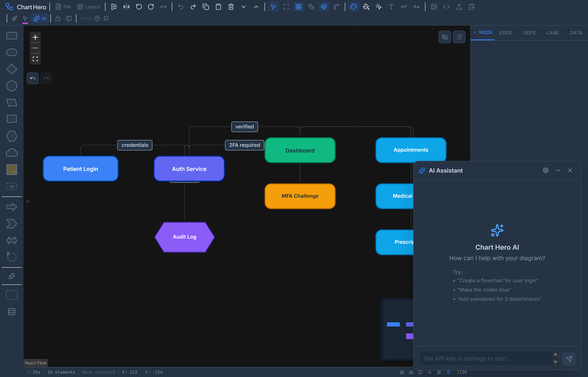

<p align="center">
  
</p>

<h1 align="center">Chart Hero</h1>

<p align="center">
  <strong>Simplify the meticulous.</strong><br>
  <sub>A free, browser-based diagramming tool. No sign-ups. No subscriptions. No server.</sub>
</p>

<p align="center">
  <a href="https://ghost-ng.github.io/Chart-Hero/"><strong>Launch App</strong></a>
  &ensp;&middot;&ensp;
  <a href="guides/wiki/home.md">User Guide</a>
  &ensp;&middot;&ensp;
  <a href="guides/FLOWCRAFT_JSON_IMPORT_RULEBOOK.md">JSON Rulebook</a>
</p>

<p align="center">
  
  
  
  
  
</p>

<br>

<p align="center">
  
</p>

<br>

## Get Started

1. **Open** [Chart Hero](https://ghost-ng.github.io/Chart-Hero/) in any modern browser
2. **Drag** a shape from the left palette onto the canvas
3. **Connect** nodes by dragging from one handle to another
4. **Style** with themes, color palettes, and the properties panel
5. **Export** as PNG, SVG, PDF, PPTX, or JSON

Everything auto-saves to your browser. Install as a desktop app via your browser's PWA prompt.

<br>

## At a Glance

<table>
  <tr>
    <td align="center" width="50%"><br><sub><b>Dark Mode</b></sub></td>
    <td align="center" width="50%"><br><sub><b>AI Assistant</b></sub></td>
  </tr>
  <tr>
    <td align="center"><br><sub><b>15 Templates</b></sub></td>
    <td align="center"><br><sub><b>Multi-Format Export</b></sub></td>
  </tr>
</table>

<br>

## Highlights

**28 shapes** &mdash; Flowchart, architecture, and specialty shapes with full customization.

**29 diagram themes** &mdash; One-click visual overhauls from Blueprint to Watercolor to Military C2.

<p align="center">
  
</p>

**21 color palettes** &mdash; Quick-color nodes with number keys **1&ndash;9**.

**AI assistant** &mdash; 37 tools across 11 categories. Create, modify, and style diagrams with natural language. Bring your own API key (Anthropic, OpenAI, OpenRouter, Groq, or any compatible endpoint).

**Swimlanes** &mdash; Horizontal rows, vertical columns, or matrix grids with collapsible lanes.

**Dependencies** &mdash; Depends-on, blocks, and related relationships with chain highlighting and critical path analysis.

**Status pucks** &mdash; Multiple draggable status badges per node (Not Started, In Progress, Completed, Blocked, Review).

**Auto-layout** &mdash; Dagre-based hierarchical arrangement in 4 directions.

**Legends** &mdash; Auto-generated from your diagram's colors, edges, and status pucks.

**Presentation mode** &mdash; Full-screen with pen, highlighter, and eraser annotations.

**Live collaboration** &mdash; Real-time peer-to-peer editing via WebRTC. Share a room link and edit the same diagram simultaneously. See remote cursors, selections, and join/leave notifications. No server required. Rooms are fully ephemeral &mdash; each browser holds exactly one room at a time, nothing is stored on any server, and when all participants leave the room simply ceases to exist. Zero memory footprint when not in use.

<p align="center">
  
</p>

<br>

## AI Assistant

<p align="center">
  
</p>

Open with the sparkle button or **Ctrl+Shift+A**. The AI sees your full diagram and can build, edit, and style it through conversation.

| Category | Examples |
|---|---|
| **Diagrams** | *"Create a CI/CD pipeline"* &mdash; generates the full diagram |
| **Nodes & Edges** | *"Add a database node"*, *"Connect Login to Dashboard"* |
| **Styles** | *"Switch to Blueprint theme"*, *"Color the servers blue"* |
| **Swimlanes** | *"Add swimlanes for 3 departments"* |
| **Layout** | *"Auto-arrange top to bottom"*, *"Align these to the left"* |
| **Legend** | *"Generate a legend"*, *"Move the legend to bottom-right"* |
| **Status** | *"Mark Deploy as blocked"* |
| **Export** | *"Export as PNG"* |
| **Research** | *"Create a diagram of the OAuth 2.0 PKCE flow"* &mdash; researches first |

Multi-provider support: **Anthropic** (Claude), **OpenAI** (GPT-4o), **OpenRouter**, **Groq**, or any OpenAI-compatible endpoint. Your API key stays in your browser and never touches a server.

<br>

## What You Can Build

| Diagram Type | How |
|---|---|
| **Flowcharts** | Rectangles, diamonds, and arrows from the shape palette |
| **Architecture diagrams** | Database, cloud, and predefined process shapes |
| **Swimlane workflows** | Horizontal, vertical, or matrix swimlanes |
| **Dependency maps** | Dependency connectors with chain highlighting |
| **C2 / COMREL charts** | Military C2 theme with relationship-typed connectors |
| **Sprint & Kanban boards** | Built-in Agile templates |
| **Mind maps** | Branch outward from a central node |
| **Decision trees** | Diamond shapes with labeled yes/no paths |

Or ask the AI: *"Create a microservices architecture diagram"* and it builds it for you.

<br>

<details>
<summary><h2>Full Feature List</h2></summary>

### Canvas & Shapes
- **28 shapes** &mdash; rectangles, diamonds, circles, ellipses, triangles, stars, parallelograms, hexagons, clouds, documents, databases, sticky notes, text boxes, callouts, block arrows, and more
- Drag-and-drop from the shape palette or press **N** to add a node
- Infinite canvas with pan, zoom, and fit-to-view
- Grid (dots, lines, cross) with configurable spacing
- Snap-to-grid with adjustable distance (4 / 8 / 16 / 32 px)
- Rulers along top and left edges
- Alignment guides that snap nodes to neighbors while dragging

### Connectors
- **6 types** &mdash; SmoothStep, Bezier, Step, Straight, Dependency, Animated
- **7+ arrowheads** &mdash; filled/open triangles, diamonds, circles, tee bars
- Draggable edge labels
- Edge reconnection &mdash; drag an endpoint to re-route
- Auto-straighten all edges (**Ctrl+Alt+S**)

### Layout & Organization
- **Auto-arrange** &mdash; Dagre hierarchical layout in 4 directions (**Ctrl+Shift+L**)
- Z-ordering &mdash; **Ctrl+]** / **Ctrl+[**, bring to front / send to back
- Alignment &mdash; left, center, right, top, middle, bottom
- Distribution &mdash; equal horizontal or vertical spacing
- Mirror / flip (**Ctrl+Shift+H**, **Ctrl+Alt+V**)
- Grouping (**Ctrl+G**) and link-grouping (**Ctrl+Shift+G**)
- Layer management with visibility, lock, opacity, and color
- Nudge &mdash; arrow keys (1 px) or Shift+arrows (10 px)

### Swimlanes
- 3 modes &mdash; horizontal rows, vertical columns, or matrix grid
- Drag-to-resize lanes, borders, and headers
- Customizable container border, title, divider styling
- Collapsible lanes
- Auto-assignment &mdash; nodes update their lane when swimlanes change

### Status Pucks
- Multiple pucks per node (Not Started, In Progress, Completed, Blocked, Review)
- Drag to any corner; Shift+drag to resize
- Custom icons, colors, borders, and sizes

### Dependencies
- 3 types &mdash; Depends On, Blocks, Related
- Chain highlighting (**Ctrl+Click**)
- Critical path analysis
- Dependency badges and walk mode

### Legends
- Two independent legends (Node and Swimlane)
- Auto-generate from diagram colors, edges, and pucks
- 5 swatch kinds &mdash; fill, border, puck, edge, lane
- Draggable, inline-editable, context-menu-driven

### Banners
- Top and bottom banners for titles, branding, or captions
- Customizable height, text, colors, and font

### Templates
15 built-in templates across 4 categories:

| Category | Templates |
|---|---|
| **General** | Blank Canvas, Simple Flowchart, Mind Map, Mind Map (Colored) |
| **Business** | Cross-Functional Flowchart, Decision Tree, Project Timeline, Process Infographic, User Journey Map |
| **Software** | Software Architecture, Deployment Pipeline, Sequence Diagram, Network Architecture |
| **Agile** | Sprint Board, Kanban Board |

### Export
- **Formats** &mdash; PNG, JPG, SVG, PDF, PPTX, JSON
- **Clipboard** &mdash; copy as PNG or SVG vector (paste into Figma, Illustrator, PowerPoint)
- PNG/JPG &mdash; scale 1&ndash;4x, quality, transparent background, padding
- PDF &mdash; A4/A3/Letter/Legal, orientation, fit-to-page, margins, auto-footer
- PPTX &mdash; standard or widescreen, title slide, speaker notes
- JSON &mdash; full-fidelity round-trip of every property

### Presentation Mode
- Full-screen with pen, highlighter, and eraser annotations
- Undo/redo strokes, export annotations, screenshot capture

### Other
- Format painter (**Ctrl+Alt+C** / **Ctrl+Shift+V**)
- Multi-line labels (Shift+Enter)
- Per-node fonts via right-click
- 1,000+ Lucide icons with color, background, outline, and sizing
- Dark mode (**Ctrl+Shift+K**)
- Context menus on nodes, edges, selections, and canvas
- Minimap with swimlane and legend overlays
- Status bar &mdash; session timer, element count, cursor position, zoom
- Custom cursors for selection, panning, connecting, and edge editing
- **Live Collaboration** &mdash; peer-to-peer real-time editing via WebRTC (Yjs + y-webrtc)
- Remote cursors, selection highlighting, and join/leave notifications
- Room sharing via URL hash with MD5-style room IDs
- PWA &mdash; install as a desktop app, works offline
- Offline fonts &mdash; all bundled locally
- Auto-save to browser localStorage

</details>

<br>

<details>
<summary><h2>Keyboard Shortcuts</h2></summary>

| Shortcut | Action |
|---|---|
| **Ctrl+S** | Save as JSON |
| **Ctrl+Z** / **Ctrl+Shift+Z** | Undo / Redo |
| **Ctrl+C** / **Ctrl+V** | Copy / Paste |
| **Ctrl+D** | Duplicate selected |
| **Ctrl+A** | Select all |
| **Delete** | Delete selected |
| **N** | Add node at center |
| **F2** | Edit label |
| **Ctrl+Shift+E** | Export dialog |
| **Ctrl+Shift+L** | Auto-arrange |
| **Ctrl+Alt+S** | Auto-straighten edges |
| **Ctrl+Shift+K** | Toggle dark mode |
| **Ctrl+Shift+A** | Toggle AI Assistant |
| **Ctrl+G** | Group selected |
| **Ctrl+Shift+G** | Link-group |
| **Ctrl+]** / **Ctrl+[** | Z-order forward / backward |
| **Ctrl+Shift+H** | Mirror horizontally |
| **Ctrl+Alt+V** | Mirror vertically |
| **Ctrl+Alt+C** | Copy style |
| **Ctrl+Shift+V** | Paste style |
| **Arrow keys** | Nudge 1 px |
| **Shift+Arrow** | Nudge 10 px |
| **1&ndash;9** | Apply palette color |
| **Ctrl+/** | Show shortcuts |
| **Escape** | Deselect / exit mode |

</details>

<br>

<details>
<summary><h2>JSON Import & Export</h2></summary>

Chart Hero's JSON format provides full-fidelity round-trip access to every property &mdash; nodes, edges, swimlanes, layers, legends, banners, viewport, and styles.

**Why JSON matters:**
- **AI pipeline** &mdash; AI systems generate JSON, Chart Hero renders it
- **Programmatic generation** &mdash; scripts create diagrams without a GUI
- **Version control** &mdash; store diagram source alongside your code
- **Automation** &mdash; CI/CD pipelines generate architecture diagrams from code analysis

**Export:** Press **Ctrl+Shift+E** &rarr; JSON tab, or **Ctrl+S** for quick save.

**Import:** Toolbar &rarr; Import button &rarr; paste JSON. Auto-validates, deduplicates IDs, and applies defaults.

See the [JSON Import Rulebook](guides/FLOWCRAFT_JSON_IMPORT_RULEBOOK.md) for the full specification.

</details>

<br>

<details>
<summary><h2>For Developers</h2></summary>

### Tech Stack

| Layer | Technology |
|---|---|
| UI framework | React 19 + TypeScript (strict) |
| Canvas engine | @xyflow/react v12 (React Flow) |
| State | Zustand v5 + Immer |
| Styling | Tailwind CSS 4 |
| Build | Vite 7 |
| Icons | Lucide React (1,000+) |
| Colors | chroma-js |
| Layout | dagre |
| Export | jspdf, pptxgenjs, html-to-image, jszip, file-saver |
| Collaboration | Yjs + y-webrtc (P2P, no server) |
| Sketch | roughjs |
| PWA | vite-plugin-pwa |
| Deploy | GitHub Pages (GitHub Actions) |

### Setup

```bash
git clone https://github.com/ghost-ng/Chart-Hero.git
cd Chart-Hero
npm install
npm run dev        # localhost:5173
```

### Build & Deploy

```bash
npm run build      # TypeScript check + Vite production build
npm run preview    # Preview locally
npm run deploy     # Deploy to GitHub Pages
```

Pushes to `main` also auto-deploy via GitHub Actions.

### Project Structure

```
src/
  components/       # React components
    Canvas/         #   FlowCanvas, GenericShapeNode, MiniMapOverlays
    Panels/         #   Toolbar, ShapePalette, PropertiesPanel
    AI/             #   AIChatPanel, AISettingsDialog, ChatMessage
    Edges/          #   Custom edge components + ArrowheadMarkers
    Legend/          #   LegendOverlay, LegendButton
    Swimlanes/      #   SwimlaneLayer, SwimlaneResizeOverlay
  collab/           # Real-time collaboration (Yjs, WebRTC, awareness)
  store/            # 12 Zustand stores (flow, ui, style, swimlane, legend,
                    #   dependency, export, settings, layer, banner, ai, collab)
  styles/           # 29 diagram themes, 21 color palettes, app CSS
  lib/ai/           # AI integration (client, streaming, tools, prompts)
  hooks/            # Custom React hooks
  utils/            # Export, layout, color, alignment, transforms
  data/             # Templates, shape definitions
```

### Architecture Notes

- **Single node renderer** &mdash; `GenericShapeNode` renders all 28 shapes via CSS clip-paths and inline SVGs
- **Immer middleware** &mdash; all stores mutate state directly inside `set()` callbacks
- **Code splitting** &mdash; Vite chunks: `react-vendor`, `flow-vendor`, `export-vendor`, `icons-vendor`, `diagram-styles`, `ai-lib`, `collab-vendor`
- **Path alias** &mdash; `@/*` maps to `src/*`

</details>

<br>

## License

[MIT](LICENSE)
