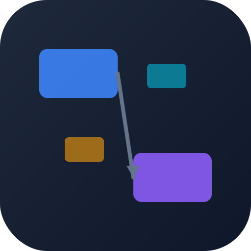
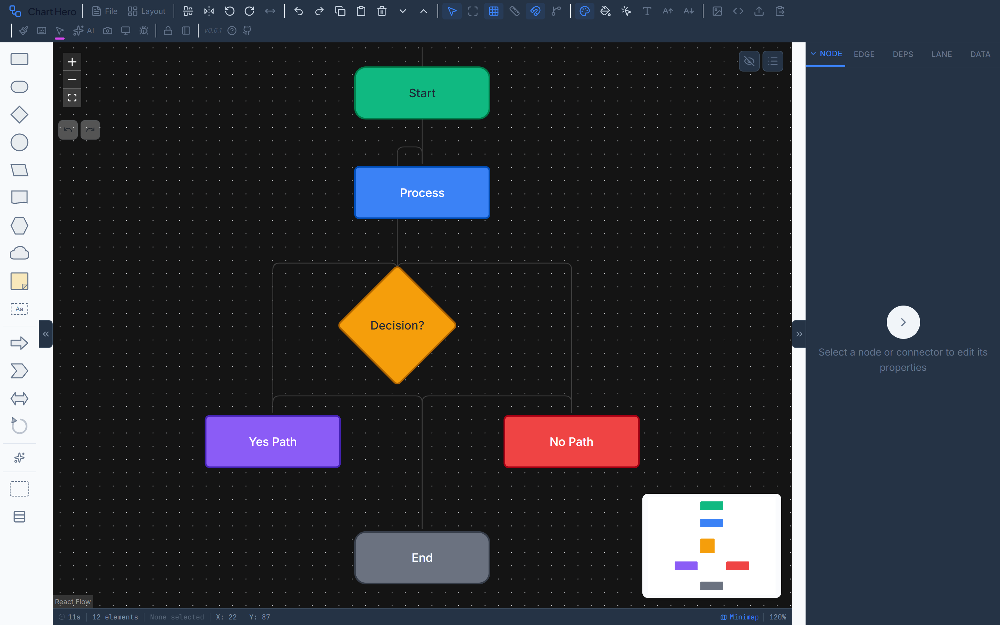
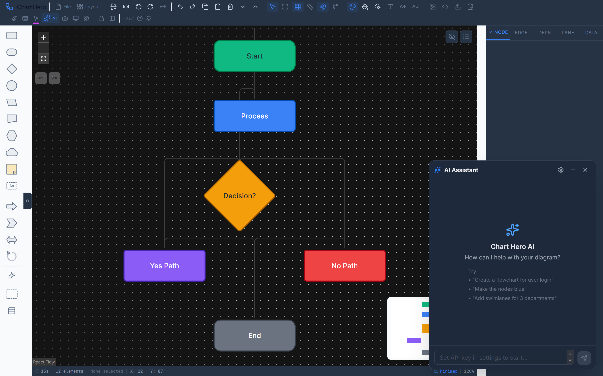
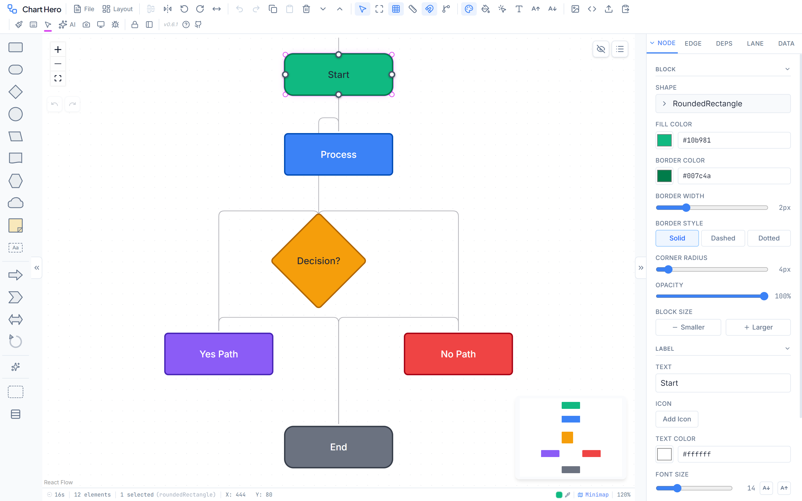
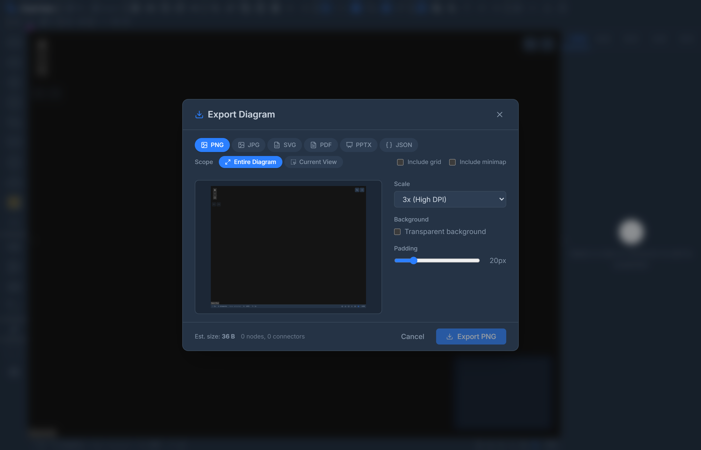
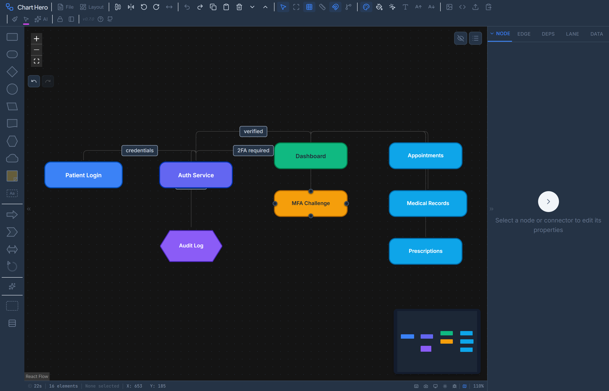
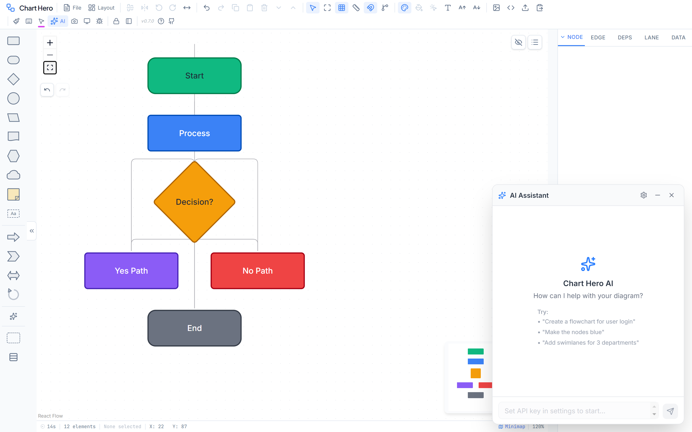
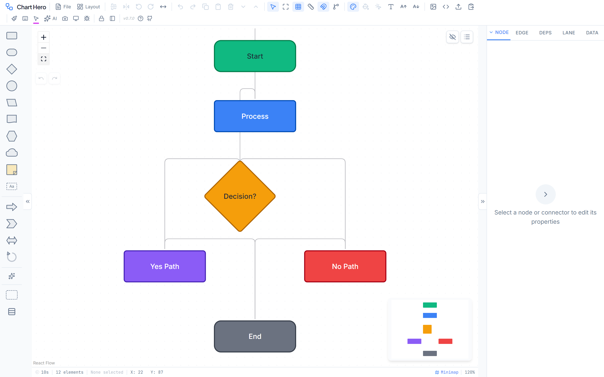

<p align="center">
  
</p>

<h1 align="center">Chart Hero</h1>

<p align="center">
  <strong>Simplify the meticulous.</strong>
</p>

<p align="center">
  A free, browser-based diagramming tool for flowcharts, architecture diagrams, swimlane workflows, dependency maps, and more.<br>
  No sign-ups. No subscriptions. No server. Everything runs in your browser.
</p>

<p align="center">
  <a href="https://ghost-ng.github.io/Chart-Hero/"><strong>Launch Chart Hero</strong></a>
  &nbsp;&middot;&nbsp;
  <a href="guides/wiki/home.md">User Guide</a>
  &nbsp;&middot;&nbsp;
  <a href="guides/FLOWCRAFT_JSON_IMPORT_RULEBOOK.md">JSON Rulebook</a>
</p>

<p align="center">
  
  
  
  
  
</p>

---

<p align="center">
  
</p>

---

## Quick Start

1. **Open** [Chart Hero](https://ghost-ng.github.io/Chart-Hero/) in any modern browser
2. **Drag** a shape from the left palette onto the canvas
3. **Double-click** a node to edit its label
4. **Drag** from a connection handle to another node to create a connector
5. **Style** your diagram with the right panel, themes, and color palettes

Your work auto-saves to browser storage. Install it as a desktop app via your browser's PWA install prompt.

---

## Screenshots

<table>
  <tr>
    <td align="center"><br><sub>Dark Mode</sub></td>
    <td align="center"><br><sub>AI Assistant</sub></td>
  </tr>
  <tr>
    <td align="center"><br><sub>Properties Panel</sub></td>
    <td align="center"><br><sub>Export Dialog</sub></td>
  </tr>
  <tr>
    <td colspan="2" align="center"><br><sub>Template Gallery — 15 ready-made templates across 4 categories</sub></td>
  </tr>
</table>

---

## AI Assistant



Chart Hero includes a built-in AI assistant that understands your diagram and can build, modify, and style it through natural language. Open it with the sparkle button in the toolbar or **Ctrl+Shift+A**.

**What the AI can do** — 35 tools across 8 categories:

| Category | Tools | Examples |
|---|---|---|
| **Canvas** | generate_diagram, clear_canvas, auto_layout | *"Create a CI/CD pipeline"*, *"Auto-arrange top to bottom"* |
| **Nodes** | add, update, remove, list, move, resize, duplicate | *"Add a database node"*, *"Make the Start node larger"* |
| **Edges** | add, update, remove, list | *"Connect Login to Dashboard"*, *"Make all edges dashed"* |
| **Selection** | select_nodes, select_edges, clear, get | *"Select all diamond shapes"* |
| **Styles** | set_diagram_style, set_color_palette, set_node_color, toggle_dark_mode | *"Switch to Blueprint theme"*, *"Color the servers blue"* |
| **Swimlanes** | add, update, remove, assign_node_to_lane | *"Add swimlanes for 3 departments"* |
| **Layout** | align_nodes, distribute_nodes | *"Align these nodes to the left"* |
| **Status & Deps** | set_status_puck, add_dependency, export_diagram | *"Mark Deploy as blocked"*, *"Export as PNG"* |

**Multi-provider support** — bring your own API key for any of these providers:
- **Anthropic** — Claude Opus, Sonnet, Haiku
- **OpenAI** — GPT-4o, GPT-4 Turbo, o1
- **OpenRouter** — access hundreds of models through one key
- **Groq** — ultra-fast Llama inference
- **Custom** — any OpenAI-compatible endpoint

Your API key stays in your browser (session or localStorage) and never touches a server. Streaming responses show the AI's reply as it types.

---

## Beyond PowerPoint

Chart Hero provides capabilities that traditional presentation tools like PowerPoint, Google Slides, or Keynote simply don't offer:

| Capability | What it does | PowerPoint? |
|---|---|---|
| **Snap-to-Grid** | Configurable snap distances (4/8/16/32 px) independent of grid spacing | Limited snapping |
| **Auto-Arrange** | Dagre-based hierarchical layout in 4 directions (TB/LR/BT/RL) — **Ctrl+Shift+L** | No auto-layout |
| **Auto-Straighten** | Aligns connected nodes to produce perfectly straight connectors — **Ctrl+Alt+S** | Manual only |
| **Dependency Tracking** | Depends-on / Blocks / Related relationships with chain highlighting and critical path | Not available |
| **Status Pucks** | Multiple draggable status badges per node (Not Started, In Progress, Completed, Blocked, Review) | Not available |
| **Swimlane Matrix** | Horizontal, vertical, or combined matrix grid with collapsible lanes | Basic tables only |
| **AI Editing** | Natural language commands: *"Create a microservices diagram"* | Not available |
| **Format Painter** | Copy styles between elements with Ctrl+Alt+C / Ctrl+Shift+V | Similar |
| **Legend Auto-Gen** | One-click legend generation by scanning your diagram | Manual only |
| **JSON Round-Trip** | Full-fidelity programmatic access to every property in your diagram | Not available |
| **24 Diagram Themes** | One-click complete visual makeovers (Blueprint, Neon, Watercolor, Sketch, etc.) | Limited themes |
| **Presentation Mode** | Full-screen with pen, highlighter, and eraser annotations | Separate app |
| **Offline PWA** | Install as a desktop app, works without internet | Requires install |

---

## Diagram Styles & Visual Design



### 24 Diagram Themes

Apply a complete visual transformation with one click. Each theme reskins all nodes, edges, and the canvas:


| Theme | Description |
|---|---|
| Clean Minimal | Light and airy default style |
| Corporate Professional | Business-ready with subtle shadows |
| Blueprint | Technical blue grid with white outlines |
| Whiteboard Sketch | Hand-drawn look via roughjs rendering |
| Neon Dark | Glowing neon on dark canvas |
| Pastel Soft | Muted pastel tones |
| Flat Material | Material Design inspired flat colors |
| Monochrome Ink | Black and white with ink styling |
| Retro Terminal | Green-on-black terminal aesthetic |
| Watercolor | Soft watercolor paint textures |
| Glass Morphism | Frosted glass transparency effects |
| Wireframe | Minimal wireframe outlines |
| Military C2 | NATO-style command and control |
| Infographic Bold | Vivid colors for data storytelling |
| Colorful Gradient | Rich gradient fills |
| Dark Neon Glow | Dark mode with neon accents |
| Notebook | Lined paper notebook feel |
| Gradient Cards | Card-style with gradient backgrounds |
| Cyber C2 | Cybersecurity operations center theme |
| Zinc Modern | Ultra-clean SaaS aesthetic |
| Soft Gradient | Modern editorial pastel feel |
| Midnight Luxe | Luxury dark theme with gold accents |
| Paper Print | Warm book typography, print-ready |
| Aurora Borealis | Northern lights with neon accents |

### 21 Color Palettes

Quick-color selected nodes with number keys **1–9**: Ocean, Berry, Forest, Sunset, Grayscale, Cyber, Pastel Dream, Earth Tone, Military, Accessible, Slate Command, Midnight Aurora, Rose Gold, Nordic Frost, Terracotta, Lavender Fields, Tropical, Candy Pop, Tokyo Night, Coral Reef, Vintage Sage.

### Per-Node Customization

Every node supports independent styling: fill color, border (color/width/style), corner radius (0–50 px), opacity, font family, font size, font weight, text color, text alignment, 1,000+ Lucide icons with icon color, background, outline, and sizing.

---

## JSON Import & Export

Chart Hero's JSON format provides **full-fidelity round-trip** access to every property in your diagram — nodes, edges, swimlanes, layers, legends, banners, viewport, and styles.

### Why JSON Matters

- **AI-to-diagram pipeline** — AI systems generate JSON, Chart Hero renders it instantly
- **Programmatic generation** — scripts and tools can create diagrams without a GUI
- **Version control** — store diagram source in git alongside your code
- **Sharing** — exchange diagrams between Chart Hero instances with zero data loss
- **Automation** — CI/CD pipelines can generate architecture diagrams from code analysis

### Export

Press **Ctrl+Shift+E** and select the **JSON** tab — or **Ctrl+S** for a quick save. Includes pretty print option. The exported file contains every property: node positions, shapes, colors, icons, status pucks, edge routes, arrowheads, swimlane configuration, legend items, banner text, layer visibility, and viewport state.

### Import

Click the **Import** button in the toolbar. Paste JSON into the dialog and click Import. Chart Hero validates the structure, auto-deduplicates node IDs, applies sensible defaults for missing fields, and silently ignores invalid properties.

### JSON Import Rulebook

The [JSON Import Rulebook](guides/FLOWCRAFT_JSON_IMPORT_RULEBOOK.md) is the authoritative specification for AI-generated Chart Hero diagrams. It documents every supported field, valid value, sizing guideline, and layout best practice.

---

## What You Can Build

| Diagram Type | How |
|---|---|
| **Flowcharts** | Drag rectangles, diamonds, and arrows from the shape palette |
| **Architecture diagrams** | Use database, cloud, and predefined process shapes |
| **Swimlane workflows** | Enable horizontal, vertical, or matrix swimlanes |
| **Dependency maps** | Add dependency connectors and visualize critical paths |
| **Kanban / Sprint boards** | Start from built-in Agile templates |
| **Mind maps** | Branch outward from a central node |
| **Network diagrams** | Combine infrastructure shapes with typed connectors |
| **Decision trees** | Use diamond shapes with labeled yes/no paths |

Or just ask the AI: *"Create a CI/CD pipeline flowchart"* and it builds it for you.

---

## All Features

### Canvas & Shapes
- **28 shapes** — rectangles, rounded rectangles, diamonds, circles, ellipses, triangles, stars, parallelograms, hexagons, clouds, documents, databases, sticky notes, text boxes, callouts, arrows, and more
- **Drag-and-drop** from the shape palette or press **N** to add a node
- **Infinite canvas** with pan, zoom, and fit-to-view
- **Grid** with dots, lines, or cross styles and configurable spacing
- **Snap-to-grid** with adjustable distance (4 / 8 / 16 / 32 px) — independent of grid spacing
- **Rulers** along top and left edges for precise placement

### Connectors
- **6 connector types** — SmoothStep, Bezier, Step, Straight, Dependency, Animated
- **7+ arrowhead styles** — filled/open triangles, filled/open diamonds, filled/open circles, tee bars
- **Edge labels** — draggable labels on any connector
- **Auto-Straighten** — align connected nodes for perfectly straight paths (**Ctrl+Alt+S**)

### Layout & Organization
- **Auto-Arrange** — Dagre-based hierarchical layout (**Ctrl+Shift+L**) with 4 directions (TB / LR / BT / RL)
- **Z-ordering** — Ctrl+] / Ctrl+[ to move forward/backward, Ctrl+Shift+] / Ctrl+Shift+[ for front/back
- **Alignment** — left, center, right, top, middle, bottom
- **Distribution** — equal horizontal or vertical spacing
- **Mirror / Flip** — flip arrangements horizontally (**Ctrl+Shift+H**) or vertically (**Ctrl+Alt+V**)
- **Grouping** — group (**Ctrl+G**) and link-group (**Ctrl+Shift+G**) for coordinated operations
- **Layer management** — multiple layers with visibility, lock, opacity, and color controls
- **Nudge** — arrow keys (1 px) or Shift+arrows (10 px) for precise positioning

### Swimlanes
- **3 modes** — horizontal rows, vertical columns, or matrix grid
- **Drag to resize** lanes, including borders and headers
- **Customizable container** — border color, width, style, corner radius, title
- **Divider styling** — independent color, width, and style for lane dividers
- **Label font & rotation** — control header text size and angle
- **Collapsible lanes** to save space

### Status Indicators (Pucks)
- **Multiple pucks per node** — Not Started, In Progress, Completed, Blocked, Review
- **Drag pucks** to any corner of a node
- **Custom icons, colors, borders, and sizes** per puck
- **Shift+drag** to resize pucks

### Dependencies
- **3 dependency types** — Depends On, Blocks, Related
- **Chain highlighting** — Ctrl+Click a node to highlight its full upstream/downstream chain
- **Critical path analysis** — toggle to identify and highlight the longest path
- **Dependency badges** — visual in/out count indicators on nodes
- **Walk mode** — step through a dependency chain node-by-node

### Legends
- **Two independent legends** — Node Legend (colors, pucks, edges) and Swimlane Legend (lane colors)
- **Auto-generate** — scan your diagram to populate legend items automatically
- **5 swatch kinds** — fill, border, puck, edge, lane — each with distinct rendering
- **Draggable & editable** — inline editing, context menu, repositioning

### Banners
- **Top and bottom banners** — add titles, branding, or captions above/below the canvas
- **Customizable** — height, text, background color, text color, font family, font size

### Templates
15 built-in templates across 4 categories:

| Category | Templates |
|---|---|
| **General** | Blank Canvas, Simple Flowchart, Mind Map, Mind Map (Colored) |
| **Business** | Cross-Functional Flowchart, Decision Tree, Project Timeline, Process Infographic, User Journey Map |
| **Software** | Software Architecture, Deployment Pipeline, Sequence Diagram, Network Architecture |
| **Agile** | Sprint Board, Kanban Board |

### Export
- **Export to** PNG, JPG, SVG, PDF, PPTX, and JSON
- **Copy to clipboard** as PNG or SVG vector (paste into Figma, Illustrator, PowerPoint)
- **PNG / JPG** — configurable scale (1–4x), quality, transparent background, padding
- **PDF** — page size (A4 / A3 / Letter / Legal), orientation, fit-to-page, margins, auto-footer
- **PPTX** — standard or widescreen, title slide, speaker notes

### Presentation Mode
- Full-screen presentation with annotation tools
- **Pen** — red freehand drawing, **Highlighter** — yellow highlighting, **Eraser** — remove strokes
- **Undo/Redo** strokes, export annotations, screenshot capture

### Other
- **Format painter** — copy and paste styles between elements (**Ctrl+Alt+C** / **Ctrl+Shift+V**)
- **Multi-line labels** — Shift+Enter for newlines inside nodes
- **Per-node fonts** — right-click to set font family per node
- **1,000+ icons** from Lucide with icon color, background, outline, and sizing
- **Dark mode** — full dark theme (**Ctrl+Shift+K**)
- **Context menus** — right-click nodes, edges, selections, or the canvas for contextual actions
- **Minimap** — navigator overlay showing the full diagram
- **Status bar** — session timer, element count, cursor position, zoom level
- **PWA** — install as a desktop app, works offline
- **Offline fonts** — all fonts bundled locally, no CDN required
- **Auto-save** — work persists in browser localStorage

---

## Keyboard Shortcuts

| Shortcut | Action |
|---|---|
| **Ctrl+S** | Save diagram as JSON |
| **Ctrl+Z** / **Ctrl+Shift+Z** | Undo / Redo |
| **Ctrl+C** / **Ctrl+V** | Copy / Paste nodes |
| **Ctrl+D** | Duplicate selected |
| **Ctrl+A** | Select all |
| **Delete** / **Backspace** | Delete selected |
| **N** | Add new node at canvas center |
| **F2** | Edit selected node label |
| **Ctrl+Shift+E** | Open export dialog |
| **Ctrl+Shift+L** | Auto-arrange (hierarchical layout) |
| **Ctrl+Alt+S** | Auto-straighten all edges |
| **Ctrl+Shift+K** | Toggle dark mode |
| **Ctrl+Shift+A** | Toggle AI Assistant |
| **Ctrl+G** | Group selected |
| **Ctrl+Shift+G** | Link-group selected |
| **Ctrl+]** / **Ctrl+[** | Z-order forward / backward |
| **Ctrl+Shift+]** / **Ctrl+Shift+[** | Bring to front / Send to back |
| **Ctrl+Shift+H** | Mirror horizontally |
| **Ctrl+Alt+V** | Mirror vertically (flip) |
| **Ctrl+Alt+C** | Copy style (format painter) |
| **Ctrl+Shift+V** | Paste style |
| **Arrow keys** | Nudge selected (1 px) |
| **Shift+Arrow** | Nudge selected (10 px) |
| **1–9** | Apply palette color to selected |
| **Ctrl+/** | Show keyboard shortcuts |
| **Escape** | Deselect / exit mode |

---

## For Developers

### Tech Stack

| Layer | Technology |
|---|---|
| **UI framework** | React 19 + TypeScript (strict mode) |
| **Canvas engine** | @xyflow/react v12 (React Flow) |
| **State management** | Zustand v5 + Immer |
| **Styling** | Tailwind CSS 4 |
| **Build tooling** | Vite 7 |
| **Icons** | Lucide React (1,000+) |
| **Color manipulation** | chroma-js |
| **Auto-layout** | dagre |
| **Export** | jspdf, pptxgenjs, html-to-image, jszip, file-saver |
| **Sketch rendering** | roughjs |
| **PWA** | vite-plugin-pwa |
| **Deployment** | GitHub Pages (GitHub Actions CI/CD) |

### Setup

```bash
git clone https://github.com/ghost-ng/Chart-Hero.git
cd Chart-Hero
npm install
npm run dev        # Start dev server at localhost:5173
```

### Build & Preview

```bash
npm run build      # TypeScript type-check + Vite production build
npm run preview    # Preview the built output locally
```

### Deploy

```bash
npm run deploy     # Deploy dist/ to GitHub Pages via gh-pages
```

Pushes to `main` also trigger automatic deployment via GitHub Actions.

### Project Structure

```
src/
  components/       # React components
    Canvas/         #   FlowCanvas, GenericShapeNode (single renderer for all shapes)
    Panels/         #   Toolbar, ShapePalette, PropertiesPanel
    AI/             #   AIChatPanel, AISettingsDialog, ChatMessage
    Edges/          #   Custom edge components + ArrowheadMarkers
    PresentationMode/ # Full-screen presentation overlay
  store/            # 11 Zustand stores (flow, ui, style, swimlane, legend,
                    #   dependency, export, settings, layer, banner, ai)
  styles/           # 24 diagram themes, 21 color palettes, app CSS
  lib/ai/           # AI integration (client, streaming, tools, prompts, providers)
  hooks/            # Custom React hooks (keyboard shortcuts, menu positioning)
  utils/            # Utilities (export, layout, color, alignment, transforms)
  data/             # Templates, shape definitions
  types/            # Supplementary TypeScript types
```

### Architecture Highlights

- **Single node renderer** — `GenericShapeNode` renders all 28 shape types via CSS clip-paths and inline SVGs
- **Immer middleware** — all stores mutate state directly inside `set()` callbacks
- **Code splitting** — Vite splits output into `react-vendor`, `flow-vendor`, `export-vendor`, `icons-vendor`, `diagram-styles`, and `ai-lib` chunks
- **Path alias** — `@/*` maps to `src/*`

---

## License

[MIT](LICENSE)
