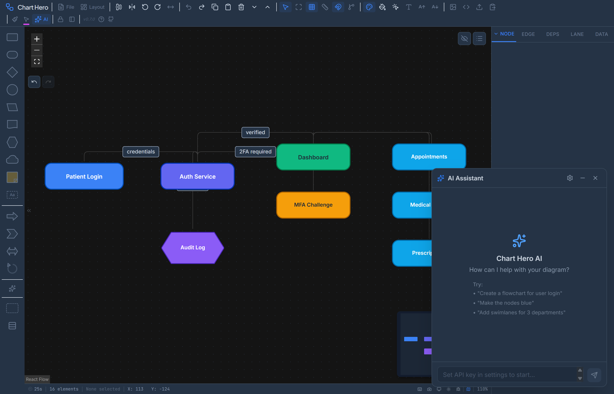

# AI Assistant

Chart Hero includes a built-in AI chat assistant that can create, modify, and style diagrams using natural language. The AI has access to 31 specialized tools organized into 8 categories, and it can chain multiple tool calls per message to perform complex operations in a single conversation turn.

---

## Setup

1. Click the **AI Assistant** button (sparkles icon) in the toolbar, or press `Ctrl+Shift+A`.
2. Click the **gear icon** in the chat panel header to open settings.
3. Select a **provider** from the dropdown.
4. Paste your **API key** into the key field.
5. Click **Test Connection** to verify the key and endpoint are valid.
6. Close settings and start chatting.

### Supported Providers

| Provider | Endpoint | Default Models |
|----------|----------|----------------|
| Anthropic | api.anthropic.com | claude-opus-4-6, claude-sonnet-4-5-20250929, claude-haiku-4-5-20251001 |
| OpenAI | api.openai.com | gpt-4o, gpt-4o-mini, gpt-4-turbo, gpt-3.5-turbo, o1, o1-mini |
| OpenRouter | openrouter.ai | claude-sonnet-4-5, gpt-4-turbo-preview, gemini-pro-1.5, llama-3.1-70b-instruct |
| Groq | api.groq.com | llama-3.1-70b-versatile, llama-3.1-8b-instant |
| Custom | User-defined | User-defined (auto-detects Anthropic vs OpenAI wire format from the URL) |

> **Note on OpenAI:** Some browsers block direct browser-to-API requests due to CORS. If you experience connection errors with OpenAI, use OpenRouter as an alternative -- it proxies OpenAI models without CORS issues.

For providers that expose a `/models` endpoint (OpenAI, OpenRouter, Groq, Custom), the settings dialog can fetch your available models automatically. Click the **refresh** button next to the model dropdown to load the list.

### API Key Storage

| Mode | Behavior |
|------|----------|
| Session Only (default) | Key is stored in `sessionStorage` and cleared when you close the browser tab. |
| Remember in Browser | Key is stored in `localStorage` and persists across sessions until you clear it. |

> Your API key is sent directly from your browser to the provider's API. It never passes through any Chart Hero server.

---

## Chat Panel Features

**Draggable** -- Grab the panel header to move it anywhere on screen.

**Resizable** -- Drag any edge or corner to resize the panel. Minimum size is 320 x 350 pixels.

**Streaming** -- Responses stream in real time with a typing indicator. Click the stop button (square icon) to cancel a response in progress.

**Multi-line input** -- Press `Shift+Enter` to insert a new line. Press `Enter` alone to send the message.

**Tool execution** -- The AI automatically calls diagram tools when needed. It can chain up to 10 rounds of tool calls per message, allowing complex multi-step operations in a single conversation turn.

**Markdown rendering** -- Bold text, inline code, and line breaks render inside chat messages.

**Clear conversation** -- Use the trash icon in the panel header to clear all messages and start fresh.

---

## Tool Reference

The AI has access to 31 tools across 8 categories. You do not need to call tools by name -- simply describe what you want in natural language and the AI selects the appropriate tools automatically.

### Canvas Operations (3 tools)

| Tool | Description |
|------|-------------|
| `generate_diagram` | Generate a complete diagram from a natural language description. Replaces the current canvas contents with a full set of nodes and edges. |
| `clear_canvas` | Remove all nodes and edges from the canvas. |
| `auto_layout` | Arrange all nodes hierarchically using the Dagre layout engine. Supports four directions: top-to-bottom (TB), left-to-right (LR), bottom-to-top (BT), and right-to-left (RL). Optional horizontal and vertical spacing parameters. |

### Node Operations (7 tools)

| Tool | Key Parameters | Description |
|------|---------------|-------------|
| `add_node` | label, shape, x, y, color, borderColor, textColor, width, height, icon, fontSize, description, notes | Add a single node to the diagram. Only `label` is required; all other properties have sensible defaults. |
| `update_node` | node_id, label, shape, color, borderColor, textColor, width, height, fontSize, fontWeight, opacity, borderStyle, borderWidth, borderRadius, icon, description, notes | Update any combination of properties on an existing node. Only the specified properties are changed. |
| `remove_nodes` | node_ids[] | Remove one or more nodes. Connected edges are automatically removed. |
| `list_nodes` | include_positions, include_styles | List all nodes on the canvas. Optionally includes position coordinates and style details. |
| `move_node` | node_id, x, y | Move a node to specific canvas coordinates. |
| `resize_node` | node_id, width, height | Resize a node to specific pixel dimensions. |
| `duplicate_node` | node_id, offset_x, offset_y | Clone a node with an offset from the original position (default offset: 50px in both axes). |

**Available shapes:** rectangle, roundedRectangle, diamond, circle, ellipse, parallelogram, hexagon, triangle, star, cloud, arrow, callout, document, predefinedProcess, manualInput, preparation, data, database, internalStorage, display, blockArrow, chevronArrow, doubleArrow, circularArrow, stickyNote, textbox.

### Edge Operations (4 tools)

| Tool | Key Parameters | Description |
|------|---------------|-------------|
| `add_edge` | source, target, label, type, color, animated, thickness | Connect two nodes with a connector. Only `source` and `target` node IDs are required. |
| `update_edge` | edge_id, label, color, thickness, animated, opacity, type | Update properties of an existing connector. |
| `remove_edges` | edge_ids[] | Remove one or more connectors. |
| `list_edges` | -- | List all connectors with their source, target, and properties. |

**Connector types:** smoothstep (default), bezier, straight, step.

### Selection Operations (4 tools)

| Tool | Description |
|------|-------------|
| `select_nodes` | Select specific nodes by ID. Replaces the current selection. |
| `select_edges` | Select specific edges by ID. |
| `clear_selection` | Deselect all nodes and edges. |
| `get_selection` | Return the currently selected nodes and edges with their properties. |

### Style Operations (4 tools)

| Tool | Key Parameters | Description |
|------|---------------|-------------|
| `set_diagram_style` | style_id | Apply one of 19 visual themes to the entire diagram. |
| `set_color_palette` | palette_id | Switch the active color palette used for node coloring. |
| `set_node_color` | node_ids[], color | Set the fill color on one or more nodes. |
| `toggle_dark_mode` | enabled (optional) | Toggle dark mode on or off. Omit the parameter to toggle. |

**Diagram styles:** default, blueprint, neon, pastel, corporate, minimalist, retro, watercolor, darkModern, sketch, gradient, terminal, whiteboard, elegant, vibrant, monochrome, nature, ocean, sunset.

**Color palettes:** default, pastel, earth, ocean, sunset, neon, monochrome, forest, berry, autumn, ice.

### Swimlane Operations (4 tools)

| Tool | Key Parameters | Description |
|------|---------------|-------------|
| `add_swimlane` | label, color, orientation | Add a swimlane for grouping nodes by category. Default orientation is horizontal. |
| `update_swimlane` | lane_id, label, color, orientation | Update properties of an existing swimlane. |
| `remove_swimlane` | lane_id, orientation | Remove a swimlane from the diagram. |
| `assign_node_to_lane` | node_id, lane_id | Move a node into a specific swimlane. |

### Layout Operations (2 tools)

| Tool | Key Parameters | Description |
|------|---------------|-------------|
| `align_nodes` | node_ids[], alignment | Align nodes along an axis: left, center-h, right, top, center-v, or bottom. Uses the current selection if no IDs are specified. |
| `distribute_nodes` | node_ids[], direction | Distribute nodes evenly along a horizontal or vertical axis. |

### Status, Dependencies, and Export (3 tools)

| Tool | Key Parameters | Description |
|------|---------------|-------------|
| `set_status_puck` | node_id, status, position, color, icon | Add or update a status indicator badge on a node. Statuses: none, not-started, in-progress, completed, blocked, review. Position defaults to top-right. |
| `add_dependency` | source_id, target_id, type | Create a dependency relationship between two nodes. Types: depends-on (default), blocks, related. |
| `export_diagram` | format | Export the diagram. Formats: png, svg, pdf, pptx, json. |

---

## Context Awareness

The AI receives a snapshot of your current diagram state with every message. This includes:

- Total node and edge count
- Full details of any selected nodes and edges (ID, label, shape, color, position, dimensions)
- A summary of all node labels and connections
- Active diagram style and color palette
- Dark mode state

This context allows the AI to make intelligent decisions. For example:

- **"Make it blue"** -- If nodes are selected, the AI applies the color to those nodes. If nothing is selected, it applies the color to all nodes.
- **"Connect A to B"** -- The AI finds nodes by label, resolves their IDs, and creates the edge.
- **"Add a node below the database"** -- The AI reads the database node's position and places the new node at an appropriate offset.

---

## Example Prompts

**Creating diagrams**

- "Create a CI/CD pipeline with 6 stages from code commit to production deployment"
- "Make a simple org chart with a CEO, two VPs, and four directors"
- "Build an e-commerce checkout flow with decision diamonds for payment validation"

**Modifying elements**

- "Add a database node connected to the API server"
- "Remove the logging node and reconnect its edges"
- "Change the label on node 3 to 'Auth Service'"
- "Resize all diamond nodes to 120 by 120"

**Styling**

- "Make all nodes blue with white text"
- "Apply the neon dark theme"
- "Set the earth color palette"
- "Toggle dark mode on"

**Status and dependencies**

- "Add in-progress status pucks to the middle three nodes"
- "Mark the deployment node as blocked"
- "Create a depends-on relationship from Build to Test"

**Layout**

- "Auto-arrange the diagram left to right"
- "Align the selected nodes to the top"
- "Distribute these nodes horizontally with even spacing"

**Swimlanes**

- "Create three horizontal swimlanes: Frontend, Backend, Database"
- "Move the API Gateway node into the Backend lane"

**Exporting**

- "Export as PDF"
- "Save the diagram as a PNG"

---

## Troubleshooting

**"Connection failed" when testing the API key**

- Double-check that you pasted the full key without leading or trailing spaces.
- Verify the key is active and has not been revoked in your provider's dashboard.
- For OpenAI, try OpenRouter instead if CORS errors appear in the browser console.

**The AI does not modify the diagram**

- Ensure the chat panel is connected (no error banner at the top of the panel).
- Some prompts may be ambiguous. Try being more specific, for example "add a rectangle node labeled 'Gateway' at position 200, 300" instead of "add a gateway."

**Responses are slow**

- Response speed depends on the AI provider and model. Smaller models (gpt-4o-mini, llama-3.1-8b-instant, claude-haiku) respond faster.
- Complex diagrams with many nodes increase the context size sent with each message.

**Tool calls show errors**

- If a tool call fails (for example, referencing a node ID that does not exist), the AI receives the error and typically retries with corrected parameters. You can also provide clarification in your next message.
