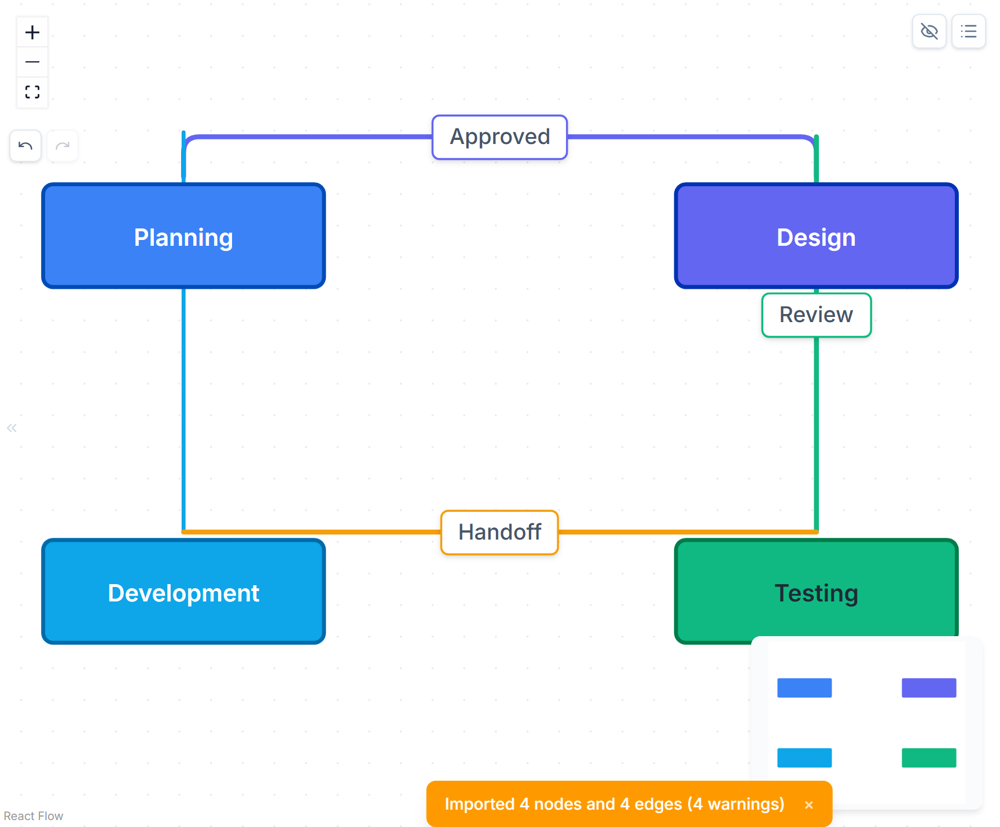
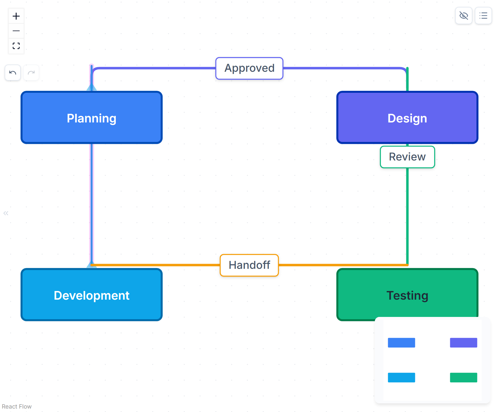
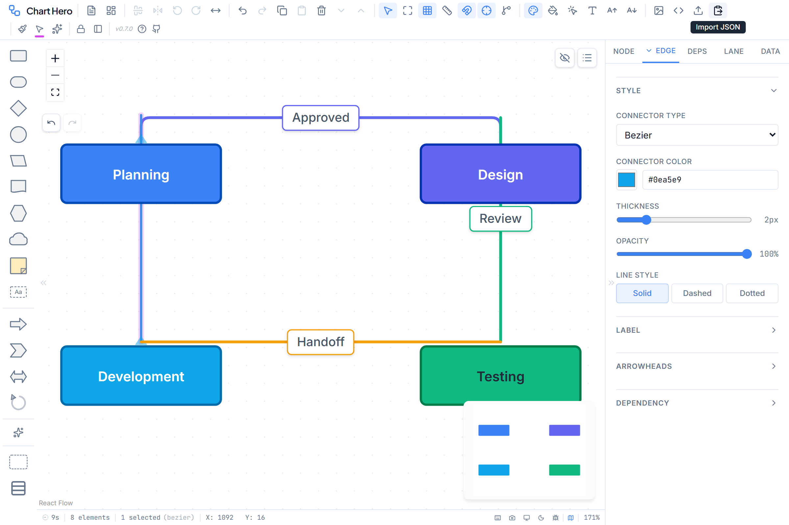

# Connectors & Edges

Connectors (also called edges) are the lines that link nodes together on the canvas. Chart Hero provides four routing algorithms, five arrowhead marker styles, draggable labels, dependency annotations, and full color and line-style control.

---

## Creating Connections

1. **Hover** over any node to reveal its connection handles -- small circles that appear on the top, bottom, left, and right edges of the shape.
2. **Click and drag** from a handle outward toward another node.
3. **Release** over the target node to complete the connection.

Chart Hero uses **loose** connection mode by default, which means the connector attaches to whichever handle on the target node is nearest to where you release the mouse. You do not have to land precisely on a handle.

> **Tip:** Self-loops (connecting a node to itself) are not allowed. If you release on the same node you started from, no connector is created.

When a connection is created it defaults to the **SmoothStep** type with a filled arrowhead on the target end.

---

## Connector Types

Chart Hero supports four routing algorithms. You can change the type of any selected connector through the Properties Panel, the right-click context menu, or by using the AI assistant.

| Type | Routing | Best For |
|------|---------|----------|
| **SmoothStep** | Rounded right-angle segments (default) | Most diagrams -- clean, professional look |
| **Bezier** | Smooth cubic curves | Organic, flowing diagrams |
| **Step** | Sharp 90-degree right-angle segments | Technical and architectural diagrams |
| **Straight** | Direct diagonal line from source to target | Simple point-to-point connections |

> Both **SmoothStep** and **Step** use the same underlying edge component (`CustomStepEdge`). SmoothStep adds rounded corners to the right-angle bends while Step keeps them sharp.

### Drag-to-Cycle Connector Type

You can quickly switch a connector's type by **clicking and dragging perpendicular to the connector line** on its body (not near the endpoint handles).

1. **Click** on the middle of a connector (away from both endpoints).
2. **Drag perpendicular** to the connector's direction -- dragging sideways across the line.
3. The connector cycles through types in order: **Straight -> Bezier -> SmoothStep -> Step** (and wraps around).
4. Release the mouse when you see the desired type.

A small **dead zone** (6 px) prevents accidental type changes from regular clicks. The type advances one step per ~40 px of perpendicular drag.

### Selection Handles

When a connector is selected, three visual indicators appear on it:

| Handle | Shape | Location | Cursor | Purpose |
|--------|-------|----------|--------|---------|
| **Type-cycle handle** | Diamond | Midpoint of the connector |  Elbow-move | Drag perpendicular to cycle the connector type (Straight, Bezier, SmoothStep, Step) |
| **Reconnect indicators** | Triangle | Source and target endpoints |  Crosshair | Shows where to click-and-drag to detach and reconnect the connector to a different node |
| **Node connection dots** | Circle | Node edges (top, bottom, left, right) |  Crosshair | Drag from a dot to create a new connection to another node |

The diamond and triangle indicators match the connector's stroke color and are semi-transparent by default, brightening on hover. Each indicator uses a custom cursor (shown above) to signal its purpose.

> **Tip:** Drag a reconnect triangle off into empty space to delete the connector.

---

## Edge Properties

Every connector exposes the following properties, all editable from the **Edge tab** in the Properties Panel.

### Style Properties

| Property | Range / Options | Default | Description |
|----------|-----------------|---------|-------------|
| Connector Type | SmoothStep, Bezier, Step, Straight | SmoothStep | Routing algorithm (also changeable by drag-to-cycle) |
| Connector Color | Any hex color | `#94a3b8` | Stroke color of the line |
| Thickness | 1 -- 6 px (0.5 px steps) | 2 px | Stroke width |
| Opacity | 0 -- 100% (5% steps) | 100% | Line transparency |
| Line Style | Solid, Dashed, Dotted | Solid | Dash pattern |
| Dash Spacing | 2 -- 24 px (varies by style) | Auto | Gap size between dashes or dots (only visible when Line Style is Dashed or Dotted) |

### Label Properties

| Property | Range / Options | Default | Description |
|----------|-----------------|---------|-------------|
| Label | Any text | (none) | Text displayed along the connector |
| Label Color | Any hex color | `#475569` | Label text color |
| Label Font Size | 8 -- 24 px | 12 px | Size of the label text |
| Label BG Color | Any hex color | `#ffffff` | Background color behind the label for readability |
| Label Position | 0.0 -- 1.0 | 0.5 (center) | Position along the edge path (0 = source end, 0.5 = midpoint, 1 = target end) |

### Arrowhead Properties

| Property | Options | Default |
|----------|---------|---------|
| Start (Source) marker | None, Arrow, Diamond, Circle, Open Arrow | None |
| End (Target) marker | None, Arrow, Diamond, Circle, Open Arrow | Arrow (filled triangle) |

### Dependency Properties

| Property | Options | Default |
|----------|---------|---------|
| Dependency Type | None, Depends On, Blocks, Related | None |

---

## Arrowhead Markers

Chart Hero defines seven SVG marker shapes internally. Five of these are exposed in the Properties Panel and context menu.

| UI Label | Marker Shape | Description |
|----------|-------------|-------------|
| **None** | (no marker) | No arrowhead rendered |
| **Arrow** | Filled triangle | Solid filled triangle pointing in the direction of flow |
| **Open Arrow** | Open triangle | Outline-only triangle (white fill, colored stroke) |
| **Diamond** | Filled diamond | Solid diamond shape |
| **Circle** | Filled circle | Solid circle dot |

All markers use `orient="auto-start-reverse"`, which means they automatically flip direction when used on the source end versus the target end of a connector. The marker color inherits the connector's stroke color via SVG `context-stroke`.

> The codebase also defines **Open Diamond**, **Open Circle**, and **Tee** (perpendicular bar) markers internally, but these are not currently exposed in the Properties Panel dropdown.

---

## Edge Labels

Edge labels are text annotations displayed along the connector path.

**Setting a label:**

- Select the connector, then open the Properties Panel **Edge** tab and type in the **Label** field.
- Or right-click the connector and choose **Edit Label** from the context menu.

**Repositioning a label:**

Labels are **draggable**. Click and drag a label along the connector path to reposition it. The position snaps to 0.05 increments along the path (0 = source, 0.5 = center, 1 = target). Labels follow the actual path geometry -- on curved or right-angle connectors, the label stays on the line rather than cutting across corners.

**Styling a label:**

Once a label is set, additional controls appear in the Properties Panel:

- **Label Color** -- text color (color picker + hex input)
- **Label Font Size** -- slider from 8 to 24 px
- **Label BG Color** -- background color for readability against the canvas

Labels render with a rounded background, a thin border matching the connector color, and a subtle shadow.

---

## Context Menu

Right-click any connector to open its context menu with the following options:

| Menu Item | Description |
|-----------|-------------|
| **Connector Type** | Submenu with 4 routing types (Smooth Step, Bezier, Step, Straight) |
| **Connector Color** | Submenu with 10 quick-pick colors (blue, green, amber, red, violet, pink, cyan, gray, orange, teal) |
| **Edit Label** | Opens label editing for the connector |
| **Label Font Size** | Submenu to change the label text size |
| **Straighten** | Resets edge routing by repositioning connected nodes |
| **Delete** | Removes the connector |

---

## Straightening Edges

Over time, as you move nodes around manually, connectors can develop unnecessary bends and detours. Chart Hero provides two ways to clean them up.

**Single or selected edges:**

Right-click a connector and choose **Straighten** from the context menu.

**All edges at once:**

Use the toolbar button **Straighten All Edges** or press `Ctrl+Alt+S`. This repositions connected nodes so that the connectors between them run in straight, clean paths.

> Straightening modifies **node positions**, not connector routing. It works by aligning the source and target nodes so the connector naturally draws as a straight or minimal-bend line.

---

## Dependency Edges

Any connector can be annotated with a dependency relationship. This integrates with Chart Hero's dependency tracking system.

**Setting a dependency type:**

1. Select the connector.
2. Open the Properties Panel **Edge** tab.
3. In the **Dependency** section, choose a type from the dropdown.

**Dependency types:**

| Type | Meaning |
|------|---------|
| **None** | Regular connector with no dependency semantics |
| **Depends On** | The target node depends on the source node |
| **Blocks** | The source node blocks the target node |
| **Related** | The two nodes are related but without strict ordering |

When a dependency type is set, the connector uses the **DependencyEdge** renderer, which can display a small pill badge on the connector indicating the relationship type. Dependency edges also participate in the **Dependencies** panel's chain visualization and walk mode.

> **Tip:** You can also create dependency edges from the Dependencies panel using quick-link mode, which lets you click two nodes in sequence to create a typed dependency connector between them.

---

## Animated Edges

Connectors can use an **animated** dashed-line effect. Animated edges use the CSS animation `charthero-edge-dash` to create a flowing dash pattern along the connector path.

Animated edges share all the same properties as regular connectors (color, thickness, opacity, labels, markers) but add the moving dash animation.

> Animated edges are primarily applied through diagram styles or programmatic imports. They are registered as a separate edge type (`animated`) in the edge type registry.

---

## Multi-Selection Editing

When multiple connectors are selected, changes made in the Properties Panel apply to **all selected connectors** simultaneously. This makes it easy to bulk-update color, thickness, type, or arrowheads across many connectors at once.

---

## Related Pages

- [Properties Panel](properties-panel.md) -- Full reference for the Edge tab controls
- [Status Pucks and Dependencies](status-pucks-dependencies.md) -- Dependency chain visualization and walk mode
- [Keyboard Shortcuts](keyboard-shortcuts.md) -- Edge-related shortcuts
- [Shapes and Nodes](shapes-nodes.md) -- The nodes that connectors link together
