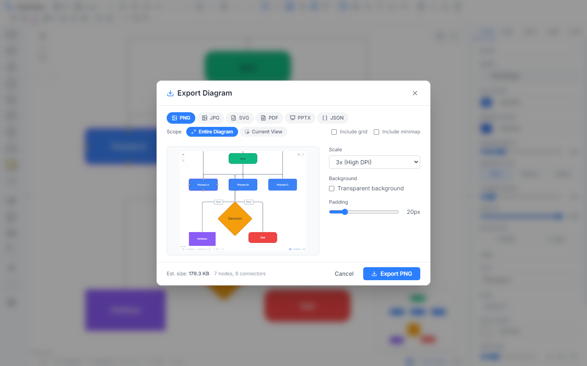
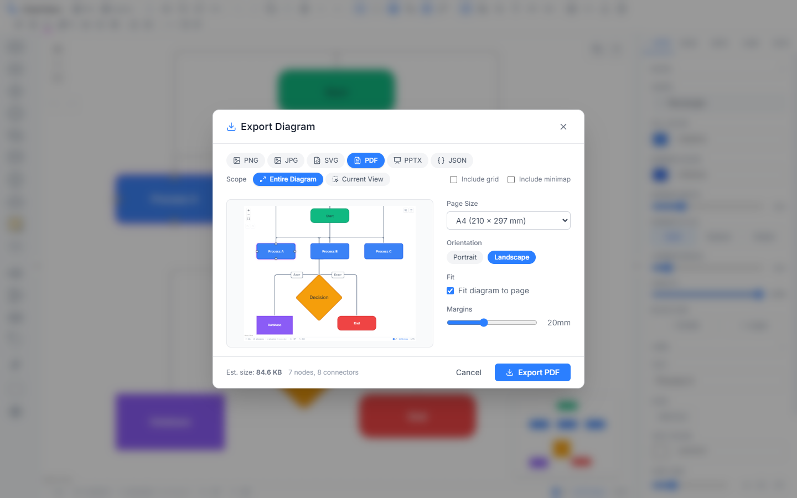
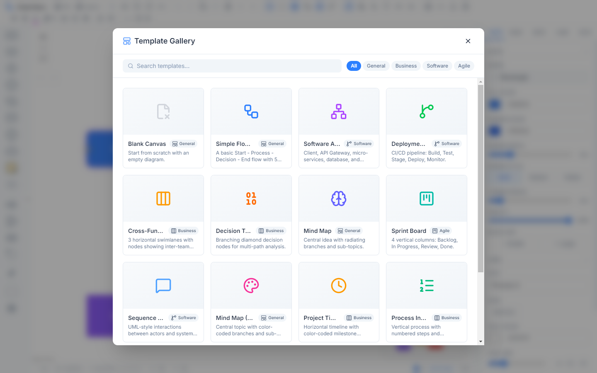

# Export & Import

Chart Hero supports six export formats (PNG, JPG, SVG, PDF, PPTX, JSON) and a full JSON import system. Access the export dialog from the toolbar Export button or with `Ctrl+Shift+E`. Import JSON from the toolbar Import JSON button or via File > Open.

---

## Export Dialog

Open the export dialog with the **Export** button in the toolbar or press `Ctrl+Shift+E`. The dialog displays a live preview of your diagram on the left and format-specific options on the right.

### Format Tabs

Six format tabs appear across the top of the options panel. Click a tab to switch between PNG, JPG, SVG, PDF, PPTX, and JSON. The last-used format is remembered between sessions.

### Scope Options

All formats share two scope modes that control what portion of the diagram is captured:

| Scope | Behavior |
|-------|----------|
| **Entire Diagram** | Fits the viewport to all content before capturing, so every node and edge is included |
| **Current View** | Captures exactly what is visible in the viewport at the current zoom and pan position |

### Image Options

PNG, JPG, and SVG formats display two additional toggles:

- **Include Grid** -- When checked, the grid dots/lines/crosses appear in the exported image. Off by default.
- **Include Minimap** -- When checked, the minimap overlay is included. Off by default.

---

## Export Formats

### PNG

Raster image with optional transparency. Best for presentations, documents, and sharing on the web.

| Option | Values | Default | Description |
|--------|--------|---------|-------------|
| Scale | 1x, 2x, 3x, 4x | 3x | Resolution multiplier (3x produces high-DPI output) |
| Transparent Background | Toggle | Off | Removes the white background, producing a transparent PNG |
| Padding | 0--100 px slider | 20 px | Whitespace border around the diagram content |

### JPG

Compressed raster image. Best for smaller file sizes and email attachments where transparency is not needed.

| Option | Values | Default | Description |
|--------|--------|---------|-------------|
| Scale | 1x, 2x, 3x, 4x | 2x | Resolution multiplier |
| Quality | 10--100% slider | 92% | JPEG compression quality (higher = larger file, better detail) |
| Background Color | Color picker | `#ffffff` | Background fill color (JPG does not support transparency) |
| Padding | 0--100 px slider | 20 px | Whitespace border around the diagram content |

### SVG

Vector graphic that scales to any size without quality loss. Best for web embedding, further editing in vector tools, and high-quality print output.

| Option | Values | Default | Description |
|--------|--------|---------|-------------|
| Embed Fonts | Toggle | On | Includes font data directly in the SVG so text renders correctly without installed fonts |
| Include Styles | Toggle | On | Includes CSS styles in the SVG output |
| Padding | 0--100 px slider | 20 px | Whitespace border around the diagram content |

### PDF

Paged document format. Best for printing, formal documentation, and archiving.

| Option | Values | Default | Description |
|--------|--------|---------|-------------|
| Page Size | A4, A3, Letter, Legal | A4 | Paper dimensions |
| Orientation | Portrait, Landscape | Landscape | Page rotation |
| Fit to Page | Toggle | On | Scales the diagram to fit within the page margins |
| Margins | 0--50 mm slider | 20 mm | Page margins on all sides |

The PDF includes a small footer with the export date.

### PPTX (PowerPoint)

Native PowerPoint file with editable shapes. Best for presentations and slide decks.

| Option | Values | Default | Description |
|--------|--------|---------|-------------|
| Slide Size | Standard (4:3), Widescreen (16:9) | Widescreen | Slide dimensions |
| Title Slide | Toggle | Off | Prepends a title slide before the diagram slide |
| Speaker Notes | Toggle | Off | Includes node information as speaker notes on each slide |

Chart Hero maps its shapes to native PowerPoint shape types wherever possible, so nodes remain editable in PowerPoint.

### JSON

Chart Hero's native data format (`.fc` file extension). Best for backup, version control, AI-driven workflows, and sharing editable diagrams.

| Option | Values | Default | Description |
|--------|--------|---------|-------------|
| Pretty Print | Toggle | On | Indented, human-readable formatting |
| Include Viewport | Toggle | On | Saves the current zoom and pan position |
| Include Styles | Toggle | On | Saves the active diagram style and color palette IDs |

When metadata is included (on by default), the file also contains node and edge counts for quick inspection.

---

## Clipboard Export

Two quick clipboard actions are available directly in the toolbar without opening the export dialog:

**Copy as Image** -- Captures the diagram as a PNG and copies it to the system clipboard. You can then paste it directly into documents, chat apps, or image editors with `Ctrl+V`.

**Copy SVG** dropdown (click the dropdown arrow next to the SVG button):

- **Copy Raw Code** -- Copies the SVG source markup to the clipboard for embedding in HTML or editing in code
- **Copy for PPT** -- Copies the SVG in a format optimized for pasting into PowerPoint or Google Slides

---

## JSON Import

Chart Hero can load diagrams from JSON, either from its own export format or from JSON generated by AI and scripts.

### JSON Structure

A Chart Hero JSON file contains the following top-level keys:

| Key | Required | Description |
|-----|----------|-------------|
| `nodes` | Yes | Array of node objects, each with `id`, `position`, `type`, and `data` (label, shape, color, etc.) |
| `edges` | Yes | Array of edge objects, each with `id`, `source`, `target`, `type`, and optional `data` |
| `viewport` | No | Zoom and pan state (`x`, `y`, `zoom`) |
| `version` | No | Format version string (currently `"1.0"`) |
| `exportedAt` | No | ISO 8601 timestamp of when the file was exported |
| `metadata` | No | Summary counts (`nodeCount`, `edgeCount`) |
| `styles` | No | Active diagram style and palette IDs (`activeStyleId`, `activePaletteId`) |
| `swimlanes` | No | Full swimlane configuration (orientation, lanes, borders, dividers, labels) |
| `layers` | No | Layer definitions for z-ordering |
| `nodeLegend` | No | Node legend overlay (items, position, style, visibility) |
| `swimlaneLegend` | No | Swimlane legend overlay |
| `banners` | No | Top and bottom banner configuration |

### Import Methods

There are three ways to import JSON into Chart Hero:

1. **Import JSON button** in the toolbar -- Opens a dialog where you paste JSON text into a textarea. Chart Hero validates and loads it immediately.

2. **File > Open** -- Opens a file picker to load a `.fc` or `.json` file from disk. The file is read, validated, and applied to the canvas.

3. **AI Assistant** -- Ask the AI to generate a diagram (for example, "Generate a flowchart for user authentication"). The AI produces Chart Hero JSON and imports it directly onto the canvas.

### Validation and Error Handling

The import process is forgiving and robust:

- **Missing IDs** are auto-generated
- **Duplicate IDs** are renamed with a suffix
- **Unknown shapes** fall back to `rectangle` with a warning
- **Invalid edge types** fall back to `default`
- **Comments** in JSON (both `//` and `/* */`) are stripped before parsing
- **Trailing commas** are removed automatically
- **Missing positions** default to `(0, 0)`

After import, a summary shows how many nodes and edges were loaded, along with any warnings about data that was corrected.

### JSON Rulebook

For programmatic diagram generation (AI agents or custom scripts), Chart Hero provides a comprehensive schema specification at `guides/FLOWCRAFT_JSON_IMPORT_RULEBOOK.md`. The rulebook documents every valid node property, edge type, shape name, status indicator field, and validation rule. Keep this file in sync when extending the data model.

---

## Templates

Access templates via **File > Templates** in the toolbar. The template gallery displays pre-built diagrams organized by category.

| Category | Templates |
|----------|-----------|
| **General** | Blank Canvas, Simple Flowchart, Mind Map, Mind Map (Colored) |
| **Business** | Cross-Functional Flowchart, Decision Tree, Project Timeline, Process Infographic, User Journey Map |
| **Software** | Software Architecture, Deployment Pipeline, Sequence Diagram, Network Architecture |
| **Agile** | Sprint Board, Kanban Board |

Click a template card to load it onto the canvas. Loading a template replaces the current canvas content, so save your work first if needed.

---

## Auto-Save

Chart Hero automatically saves your work to the browser's localStorage so you never lose progress.

| Setting | Default | Description |
|---------|---------|-------------|
| Enabled | On | Toggle auto-save on or off in Settings |
| Interval | 30 seconds | How often the diagram is saved (configurable) |
| Max Slots | 5 | Number of save slots maintained in localStorage |

Auto-save runs silently in the background. You can also manually save at any time with `Ctrl+S`, which downloads a `.fc` file to disk.

> **Note:** Auto-save data is stored in your browser only. Clearing browser data or switching browsers will remove it. For permanent backup, export to JSON or save a `.fc` file.

---

## File Format Summary

| Format | Extension | Editable | Transparency | Best For |
|--------|-----------|----------|-------------|----------|
| PNG | `.png` | No | Yes (optional) | Presentations, documents, web |
| JPG | `.jpg` | No | No | Email, small file sizes |
| SVG | `.svg` | Yes (vector tools) | Yes | Web embedding, print, editing |
| PDF | `.pdf` | No | No | Printing, archiving |
| PPTX | `.pptx` | Yes (PowerPoint) | No | Slide decks, presentations |
| JSON | `.fc` / `.json` | Yes (Chart Hero) | N/A | Backup, version control, AI workflows |
