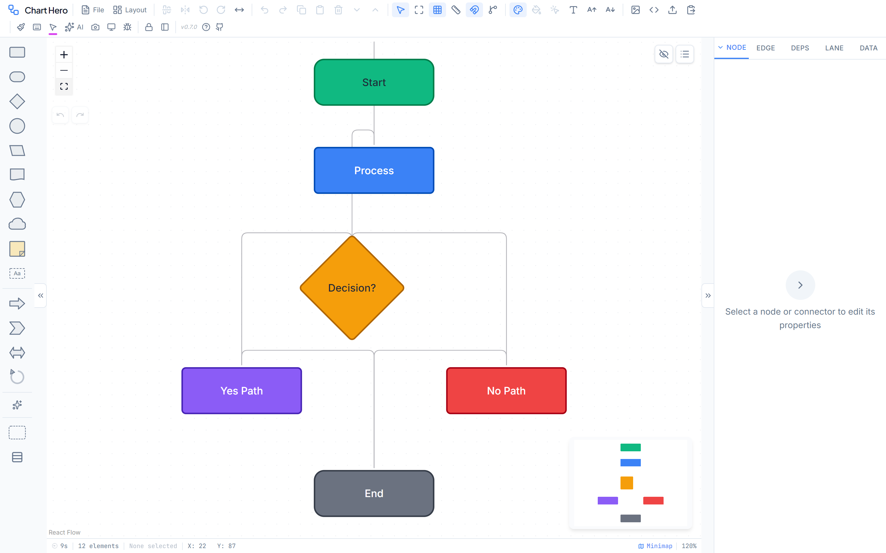
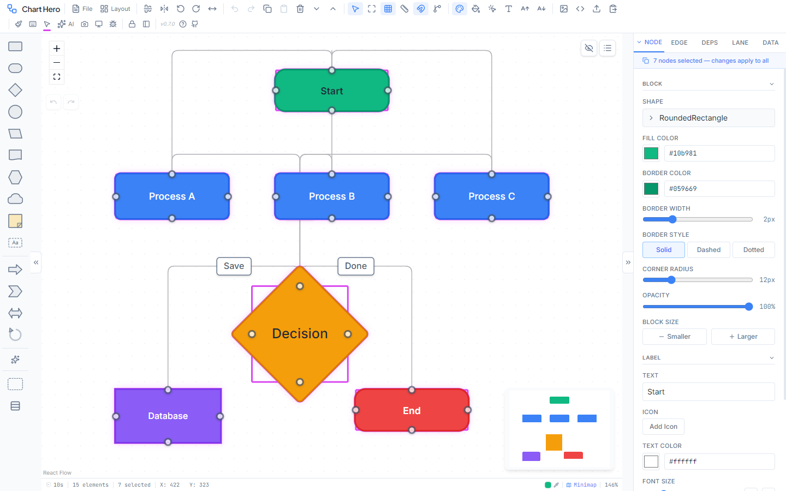
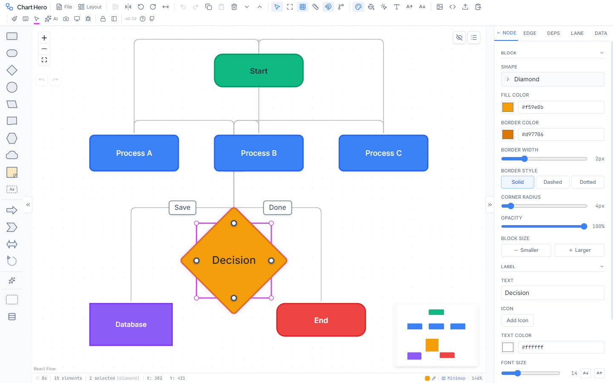

# Getting Started

Chart Hero is a browser-based diagramming application that runs entirely on the client side. There is no backend server, no account creation, and no data leaves your browser unless you explicitly export it. This page walks you through the interface, creating your first diagram, saving your work, and installing Chart Hero as a desktop app.

---

## Interface Overview

When you first open Chart Hero, you will see four main areas arranged around the canvas.

### Toolbar (top)

The toolbar spans the top of the window and contains grouped action buttons for every major operation. From left to right, the groups cover:

- **File** -- New, Open (.fc), Save (.fc), Templates, Install as App
- **Arrange** -- Auto-arrange (Dagre layout in 4 directions), auto-straighten edges, alignment (left / center / right / top / middle / bottom), distribution (horizontal / vertical spacing), mirror and flip, rotation
- **Edit** -- Undo, Redo, Copy, Paste, Delete, Z-ordering (forward / backward)
- **View** -- Select tool, Fit View, Grid toggle (dots / lines / cross), Snap-to-grid toggle, Rulers toggle, Dependency badges toggle
- **Panels** -- Properties Panel toggle, Format Painter, Select Same Type, Global Font picker, Font size increase/decrease
- **Export** -- Open export dialog, Copy to clipboard as PNG or SVG, Import JSON

Additional pinned icons appear at the right end of the toolbar: Style & Palette picker, Selection color picker, AI Assistant, Toolbar lock/unlock, and Toolbar orientation toggle. The bottom status bar contains Keyboard shortcuts, Screenshot, Presentation Mode, and Debug logging controls.

### Shape Palette (left)

The collapsible left panel provides every shape you can place on the canvas.

- **Standard shapes** (10) -- Rectangle, Rounded Rectangle, Diamond, Circle, Parallelogram, Document, Hexagon, Cloud, Sticky Note, Text Box
- **Arrow shapes** (4) -- Block Arrow, Chevron Arrow, Double Arrow, Circular Arrow
- **Group container** -- Drag to create a visual grouping region
- **Additional shapes** available via AI -- Ellipse, Triangle, Star, Arrow, Callout, Predefined Process, Manual Input, Preparation, Data (I/O), Database, Internal Storage, Display (available through the AI assistant or JSON import, not in the drag palette)
- **Icon library** -- Search and browse 1,000+ Lucide icons to attach to any node
- **Swimlane button** -- Quick-add horizontal, vertical, or matrix swimlanes

Click the collapse arrow at the top of the palette to hide it and reclaim canvas space. Click again to restore it.

### Canvas (center)

The canvas is your infinite working area. Key interactions:

- **Pan** -- Click and drag on empty space, or hold the middle mouse button
- **Zoom** -- Scroll wheel, or use the zoom controls in the toolbar
- **Select** -- Click a node or edge; hold <kbd>Shift</kbd> to add to the selection; drag a rectangle to box-select

- **Create** -- Double-click empty space to create a quick node at that location
- **Context menu** -- Right-click the canvas, a node, an edge, or a selection for contextual actions
- **Minimap** -- A small navigator overlay in the corner shows your position within the full diagram
- **Grid** -- Configurable dot, line, or cross grid with adjustable spacing
- **Snap** -- Nodes snap to the grid at configurable distances (4 / 8 / 16 / 32 px)
- **Rulers** -- Optional pixel rulers along the top and left edges for precise placement

### Properties Panel (right)

The right panel has five tabs, each focused on a different aspect of your diagram:

| Tab | Purpose |
|---|---|
| **Node** | Shape, size, position, colors, border, corner radius, opacity, label text, font, icon, status pucks |
| **Edge** | Connector type, color, width, style, label, arrowheads (source and target), animation |
| **Deps** | Dependency type (Depends On / Blocks / Related), chain highlighting, walk mode, critical path |
| **Lane** | Swimlane orientation, lane list, colors, borders, dividers, labels, collapse controls |
| **Data** | Raw JSON view of the selected element for advanced inspection |

Each tab contains collapsible sections that auto-expand based on the properties of the currently selected element. For example, selecting a node that has an icon will automatically expand the Icon section.

---

## Creating Your First Diagram

Follow these steps to build a simple flowchart from scratch.

### 1. Add a shape

Drag any shape from the Shape Palette on the left and drop it onto the canvas. Alternatively, press `N` to add a default rectangle at the center of the viewport, or double-click any empty spot on the canvas to create a node at that location.

### 2. Edit the label

Double-click the node to enter inline editing mode. Type your label text and press <kbd>Enter</kbd> to confirm. Use <kbd>Shift</kbd>+<kbd>Enter</kbd> to insert a newline for multi-line labels. Press <kbd>Escape</kbd> to cancel editing without changes. You can also press <kbd>F2</kbd> while a node is selected to begin editing.

### 3. Connect two nodes

Hover over a node to reveal its connection handles -- small circles on the top, bottom, left, and right edges. Click and drag from one handle to a handle on another node. A connector (edge) will appear linking them. The default connector type is SmoothStep; you can change it in the Properties Panel.

### 4. Label the connector

Select the edge by clicking on it. In the Properties Panel (Edge tab), type a label in the Label field. The label will appear on the connector and can be repositioned by dragging.

### 5. Color your nodes

Select one or more nodes and press a number key `1` through `9` to apply a color from the active palette. The default palette is "Ocean." You can switch palettes from the toolbar's palette picker or from the Style and Theme controls.

### 6. Auto-arrange the layout

Press <kbd>Ctrl</kbd>+<kbd>Shift</kbd>+<kbd>L</kbd> to run the auto-arrange algorithm. Chart Hero uses Dagre for hierarchical layout and supports four directions:

- **TB** -- Top to Bottom (default)
- **LR** -- Left to Right
- **BT** -- Bottom to Top
- **RL** -- Right to Left

You can change the direction from the Arrange menu in the toolbar before running auto-arrange.

### 7. Save your diagram

Press <kbd>Ctrl</kbd>+<kbd>S</kbd> to download your diagram as a `.fc` file. This file is JSON internally and can be reopened in Chart Hero at any time. Your work also auto-saves to browser localStorage, so closing the tab will not lose your progress.

---

## Opening and Saving

### Save

Press <kbd>Ctrl</kbd>+<kbd>S</kbd> or go to **File > Save (.fc)** in the toolbar. Chart Hero downloads a `.fc` file to your default download location. The `.fc` format is JSON internally and contains every property of your diagram -- nodes, edges, positions, styles, swimlanes, legends, banners, layers, and viewport state.

### Open

Go to **File > Open (.fc)** in the toolbar. Chart Hero accepts both `.fc` and `.json` files. The imported diagram replaces the current canvas. If you want to preserve your current work, save it first.

### Auto-save

Auto-save is always active. Chart Hero saves your nodes and edges to browser localStorage within one second of every change. You can close the browser tab and reopen Chart Hero later to find your diagram intact.

> **Note:** Auto-save uses browser localStorage, which is specific to the browser and device. Clearing browser data will remove auto-saved diagrams. For permanent storage, always use <kbd>Ctrl</kbd>+<kbd>S</kbd> to download a `.fc` file.

### Templates

Go to **File > Templates** in the toolbar to open the template gallery. Chart Hero includes 15 built-in templates organized into four categories:

| Category | Templates |
|---|---|
| **General** | Blank Canvas, Simple Flowchart, Mind Map, Mind Map (Colored) |
| **Business** | Cross-Functional Flowchart, Decision Tree, Project Timeline, Process Infographic, User Journey Map |
| **Software** | Software Architecture, Deployment Pipeline, Sequence Diagram, Network Architecture |
| **Agile** | Sprint Board, Kanban Board |

Click any template thumbnail to load it onto the canvas. Templates replace the current diagram, so save your work first if needed.

---

## Installing as a Desktop App

Chart Hero is a Progressive Web App (PWA). In supported browsers (Chrome, Edge, and other Chromium-based browsers), you can install it as a standalone desktop application.

**To install:**

1. Open Chart Hero in your browser
2. Go to **File > Install as App** in the toolbar, or look for the install icon in your browser's address bar
3. Confirm the installation prompt

Once installed, Chart Hero runs in its own window with its own taskbar icon. It works fully offline -- no internet connection is required after installation. All features, fonts, and icons are bundled locally.

To uninstall, right-click the Chart Hero icon in your taskbar or app launcher and select "Uninstall," or use your operating system's standard app removal process.

---

## Next Steps

Now that you know the basics, explore the rest of the guide to master every feature:

- [Canvas and Viewport](canvas-viewport.md) -- Grid types, snap settings, rulers, zoom, and minimap
- [Shapes and Nodes](shapes-nodes.md) -- All 27 shapes, sizing, icons, and node styling
- [Connectors and Edges](connectors-edges.md) -- 6 connector types, arrowheads, labels
- [Properties Panel](properties-panel.md) -- Deep dive into every property and control
- [AI Assistant](ai-assistant.md) -- Set up your API key and use natural language to build diagrams
- [Styles and Themes](styles-themes.md) -- 19 themes, 11 palettes, dark mode
- [Keyboard Shortcuts](keyboard-shortcuts.md) -- Speed up your workflow with shortcuts
- [Export and Import](export-import.md) -- PNG, SVG, PDF, PPTX, JSON, and clipboard export

Return to the [User Guide Home](home.md).
