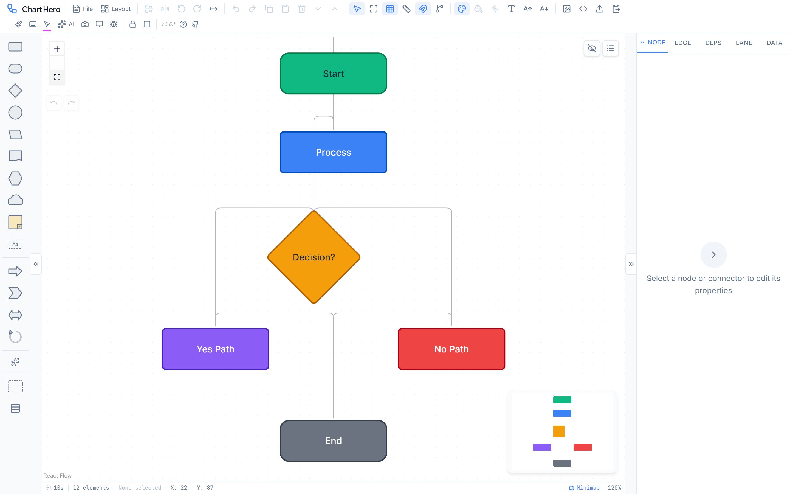

# Chart Hero User Guide

**Version 0.7.0**

Chart Hero is a free, browser-based professional diagramming application for flowcharts, architecture diagrams, swimlane workflows, dependency maps, and more. There are no sign-ups, no subscriptions, and no server -- everything runs entirely in your browser. Built on React Flow with 26 shapes, 19 diagram themes, 11 color palettes, an AI assistant with 31 tools, and full offline PWA support, Chart Hero gives you the power of enterprise diagramming tools without the price tag.

---

## What Makes Chart Hero Different

Most teams reach for PowerPoint, Visio, or Draw.io when they need a diagram. Chart Hero goes further with capabilities those tools simply do not offer.

| Capability | Chart Hero | PowerPoint / Slides | Visio | Draw.io |
|---|---|---|---|---|
| **AI-powered editing** (31 tools, natural language) | Yes | No | No | No |
| **Snap-to-grid** (4 / 8 / 16 / 32 px snap distance) | Yes | Limited | Yes | Limited |
| **Auto-arrange** (Dagre layout, 4 directions) | Yes | No | Basic | Basic |
| **Auto-straighten edges** | Yes | No | No | No |
| **Dependency tracking** (walk mode, critical path) | Yes | No | No | No |
| **Multi-status pucks per node** | Yes | No | No | No |
| **Swimlane matrix** (horizontal, vertical, combined) | Yes | No | Basic | Basic |
| **Format painter** | Yes | Yes | Yes | No |
| **Legend auto-generation** | Yes | No | No | No |
| **JSON round-trip** for AI and automation workflows | Yes | No | No | Partial |
| **19 diagram themes** (one-click visual makeover) | Yes | Limited | Limited | Limited |
| **11 color palettes** (number keys 1-9 to color nodes) | Yes | No | No | No |
| **Presentation mode** with pen, highlighter, eraser | Yes | Separate app | No | No |
| **PWA / offline** (installable desktop app) | Yes | Requires install | Requires install | Requires internet |
| **Real-time collaboration** (P2P, no server) | Yes | Cloud only | Cloud only | Cloud only |
| **Completely free** (no account, no limits) | Yes | Paid | Paid | Free with limits |

---

## Wiki Pages

1. [Getting Started](getting-started.md) -- Interface tour and creating your first diagram
2. [Canvas and Viewport](canvas-viewport.md) -- Grid, snap, rulers, zoom, pan, minimap
3. [Shapes and Nodes](shapes-nodes.md) -- All 27 shapes and node properties
4. [Connectors and Edges](connectors-edges.md) -- Edge types, labels, arrowheads
5. [Properties Panel](properties-panel.md) -- Complete panel reference with every input
6. [Toolbar Reference](toolbar-reference.md) -- Every button, dropdown, and menu
7. [AI Assistant](ai-assistant.md) -- Setup, providers, and 35-tool reference
8. [Styles and Themes](styles-themes.md) -- 19 styles, 11 palettes, dark mode
9. [Swimlanes and Banners](swimlanes-banners.md) -- Swimlane creation, matrix mode, banners
10. [Status Pucks and Dependencies](status-pucks-dependencies.md) -- Puck system, dependency chains, walk mode
11. [Legends and Layers](legends-layers.md) -- Legend overlays and layer management
12. [Export and Import](export-import.md) -- All 6 formats, JSON import, templates
13. [Keyboard Shortcuts](keyboard-shortcuts.md) -- Complete shortcut and mouse reference
14. [Settings and Preferences](settings-preferences.md) -- All configurable options
15. [Live Collaboration](collaboration.md) -- Real-time peer-to-peer editing, room sharing, presence

---

## Quick Start

1. **Open** Chart Hero in any modern browser at [ghost-ng.github.io/Chart-Hero](https://ghost-ng.github.io/Chart-Hero/)
2. **Drag** a shape from the left palette onto the canvas (or press `N` to add a node)
3. **Double-click** a node to edit its label
4. **Drag** from a connection handle on one node to another node to create a connector
5. Press <kbd>Ctrl</kbd>+<kbd>Shift</kbd>+<kbd>L</kbd> to auto-arrange the layout

Your work auto-saves to browser storage. Press <kbd>Ctrl</kbd>+<kbd>S</kbd> to download a `.fc` file you can share or reload later.

---

## Learn More

- **JSON Import Rulebook** -- The authoritative specification for AI-generated and programmatic Chart Hero diagrams. See `guides/FLOWCRAFT_JSON_IMPORT_RULEBOOK.md`.
- **Source Code** -- Chart Hero is open source under the MIT license at [github.com/ghost-ng/Chart-Hero](https://github.com/ghost-ng/Chart-Hero).
