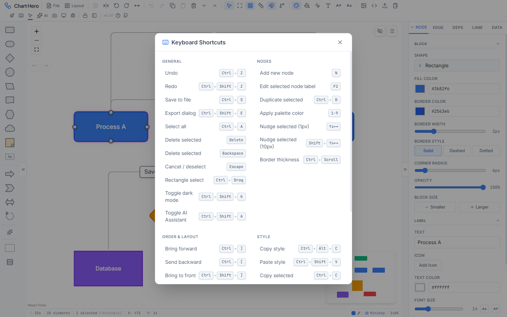
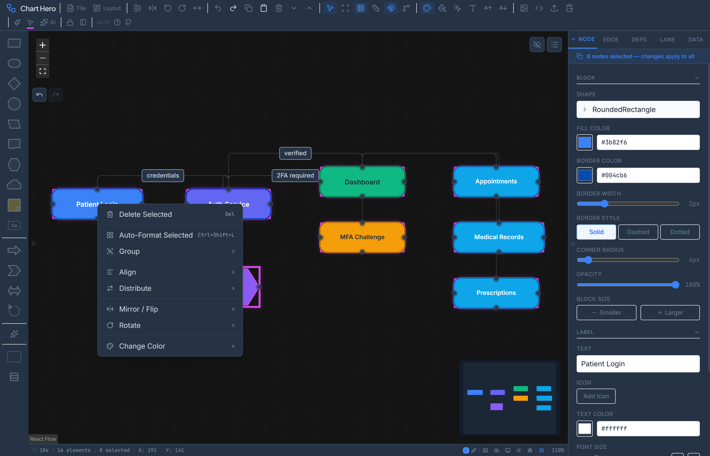

# Keyboard Shortcuts & Mouse Reference

Complete reference for all keyboard shortcuts and mouse interactions in Chart Hero. View shortcuts in-app by pressing `Ctrl+/` to open the keyboard shortcuts dialog.

---

## Keyboard Shortcuts

### General

| Shortcut | Action |
|----------|--------|
| `Ctrl+Z` | Undo |
| `Ctrl+Shift+Z` | Redo |
| `Ctrl+S` | Save diagram (downloads a `.fc` file) |
| `Ctrl+Shift+E` | Open export dialog |
| `Ctrl+A` | Select all nodes and edges |

| `Delete` / `Backspace` | Delete selected nodes and edges |
| `Escape` | Cancel current action, deselect all, or close open menus |
| `Ctrl+Shift+K` | Toggle dark mode |
| `Ctrl+Shift+A` | Toggle AI Assistant panel |
| `Ctrl+/` | Show keyboard shortcuts dialog |

### Node Creation and Editing

| Shortcut | Action |
|----------|--------|
| `N` | Add a new node at the canvas center |
| `F2` | Edit the label of the selected node (works even when focused on an input) |
| `Ctrl+D` | Duplicate selected nodes |
| `1` through `9` | Apply a color from the active palette by index (1 = first color, 9 = ninth) |

### Nudge (Move Selected Nodes)

| Shortcut | Action |
|----------|--------|
| `Arrow Up` | Nudge selected nodes up by 1 px |
| `Arrow Down` | Nudge selected nodes down by 1 px |
| `Arrow Left` | Nudge selected nodes left by 1 px |
| `Arrow Right` | Nudge selected nodes right by 1 px |
| `Shift+Arrow Up` | Nudge selected nodes up by 10 px |
| `Shift+Arrow Down` | Nudge selected nodes down by 10 px |
| `Shift+Arrow Left` | Nudge selected nodes left by 10 px |
| `Shift+Arrow Right` | Nudge selected nodes right by 10 px |

### Z-Order and Layout

| Shortcut | Action |
|----------|--------|
| `Ctrl+]` | Bring selected node forward one step |
| `Ctrl+[` | Send selected node backward one step |
| `Ctrl+Shift+]` | Bring selected node to the front (topmost) |
| `Ctrl+Shift+[` | Send selected node to the back (bottommost) |
| `Ctrl+Shift+L` | Auto-arrange layout using Dagre algorithm |
| `Ctrl+G` | Group selected nodes into a region container |
| `Ctrl+Shift+G` | Create a link group from selected nodes |

### Transform

| Shortcut | Action |
|----------|--------|
| `Ctrl+Shift+H` | Flip selected nodes horizontally (mirror) |
| `Ctrl+Alt+V` | Flip selected nodes vertically (mirror) |
| `Ctrl+Alt+S` | Straighten all edges |

### Clipboard and Style

| Shortcut | Action |
|----------|--------|
| `Ctrl+C` | Copy selected nodes |
| `Ctrl+V` | Paste copied nodes |
| `Ctrl+Alt+C` | Copy style from selected node (format painter pick) |
| `Ctrl+Shift+V` | Paste style onto selected nodes (format painter apply) |

---

## Mouse Interactions

### Canvas

| Action | Result |
|--------|--------|
| Left-click empty canvas | Deselect all nodes and edges |
| Double-click empty canvas | Create a new node at that position and enter label edit mode |
| Right-click empty canvas | Open the canvas context menu |
| Drag on empty canvas | Pan the viewport |
| Ctrl+drag on empty canvas | Draw a selection rectangle (selects nodes it touches) |
| Scroll wheel | Zoom in and out, centered on the cursor |

### Nodes

| Action | Result |
|--------|--------|
| Click a node | Select that node (deselects everything else) |
| Shift+click a node | Add the node to the current selection, or remove it if already selected |
| Double-click a node | Enter inline label editing mode |
| Right-click a node | Open the node context menu |
| Drag a node | Move the node (auto-assigns to a swimlane if swimlanes are active) |
| Drag from a connection handle | Start creating a new edge to another node |
| Ctrl+Scroll on a node | Adjust the node's border thickness |

### Edges

| Action | Result |
|--------|--------|
| Click an edge | Select that edge |
| Right-click an edge | Open the edge context menu |

### Status Pucks

| Action | Result |
|--------|--------|
| Click a puck | Select the puck (deselects nodes) |
| Shift+click a puck | Add the puck to the current puck selection |
| Drag a puck | Move the puck to a different corner of its parent node |
| Ctrl+drag a puck | Resize the puck |
| Right-click a puck | Open the puck bulk selection menu |

### Shape Palette (Left Panel)

| Action | Result |
|--------|--------|
| Click a shape | Toggle shape selection in the palette |
| Drag a shape to the canvas | Create a new node of that shape at the drop position |
| Drag an icon to the canvas | Create an icon-only node at the drop position |

### Inline Label Editing

| Action | Result |
|--------|--------|
| Double-click a label | Enter edit mode for the label text |
| `Enter` | Confirm the edit and exit edit mode |
| `Shift+Enter` | Insert a new line within the label |
| `Escape` | Cancel the edit and revert to the previous text |

---

## Context Menus

Right-click different elements on the canvas to access context-specific actions. All context menus close when you click outside them or press `Escape`.

### Canvas Context Menu

Right-click an empty area of the canvas.

| Item | Description |
|------|-------------|
| Add Node Here | Creates a new node at the click position |
| Paste | Pastes copied nodes (enabled only when the clipboard has content) |
| Select All | Selects every node and edge on the canvas |
| Fit View | Zooms and pans to fit all content in the viewport |
| Insert Swimlanes | Opens the swimlane creation dialog |

### Node Context Menu

Right-click a single node.

| Item | Shortcut | Description |
|------|----------|-------------|
| Edit Label | `F2` | Enters inline label editing mode |
| Duplicate | `Ctrl+D` | Creates a copy of the node offset slightly from the original |
| Copy | `Ctrl+C` | Copies the node to the clipboard |
| Delete | `Del` | Removes the node and its connected edges |
| Change Shape | -- | Submenu with 8 shapes: Rectangle, Rounded Rect, Diamond, Circle, Parallelogram, Hexagon, Document, Cloud |
| Add Status | -- | Submenu with 6 options: None, Not Started, In Progress, Completed, Blocked, Review |
| Change Font | -- | Submenu with 12 font families: Inter, Aptos, Calibri, Segoe UI, Arial, Franklin Gothic, Franklin Gothic Book, Verdana, Georgia, Times New Roman, Consolas, Comic Sans MS |
| Color | -- | Inline 10-color swatch grid for quick node coloring |
| Notes | -- | Opens the Data tab in the Properties Panel with the notes textarea focused |
| Select | -- | Submenu: Same Shape, Same Color, Same Outline, All Nodes |
| Order | -- | Submenu: Forward (`Ctrl+]`), Backward (`Ctrl+[`), Front (`Ctrl+Shift+]`), Back (`Ctrl+Shift+[`) |
| Align | -- | Submenu (shown only when multiple nodes are selected): Left, Center (H), Right, Top, Center (V), Bottom |

Additional items appear conditionally:

- **Edit Link Group** -- Shown when the node belongs to a link group
- **Ungroup** -- Shown when the node is a group container

### Edge Context Menu

Right-click an edge (connector line).

| Item | Description |
|------|-------------|
| Connector Type | Submenu with 4 types: Smooth Step, Bezier, Step, Straight |
| Connector Color | 10-color swatch grid |
| Edit Label | Enters inline label editing on the edge |
| Label Font Size | Submenu with sizes: 8, 9, 10, 11, 12, 14, 16, 18, 20, 24 px |
| Straighten | Straightens this specific edge |
| Delete | Removes the edge |

### Selection Context Menu

Right-click when multiple nodes are selected.

| Item | Shortcut | Description |
|------|----------|-------------|
| Delete Selected | `Del` | Removes all selected nodes and their edges |
| Auto-Format Selected | `Ctrl+Shift+L` | Applies Dagre layout to just the selected nodes |
| Group | -- | Submenu: Arrange in Region (creates a visual container), Link Group (creates a logical group) |
| Align | -- | Submenu with 6 options: Left, Center (H), Right, Top, Center (V), Bottom |
| Distribute | -- | Submenu: Horizontal, Vertical (requires 3 or more selected nodes) |
| Mirror / Flip | -- | Submenu: Flip Horizontal (`Ctrl+Shift+H`), Flip Vertical (`Ctrl+Alt+V`) |
| Rotate | -- | Submenu: 90 degrees Clockwise, 90 degrees Counter-Clockwise, 180 degrees |
| Change Color | -- | 10-color swatch grid applied to all selected nodes |

> **Note:** The Group, Mirror/Flip, and Rotate items require at least 2 selected nodes. Distribute requires at least 3.

### Puck Context Menu

Right-click a status puck badge on a node.

| Item | Description |
|------|-------------|
| Select All on Node | Selects every puck on the same node |
| Same Color | Selects all pucks across the diagram that share this puck's color |
| Same Outline | Selects all pucks with the same border style |
| All Pucks | Selects every puck on every node in the diagram |

---

## Tips

- **Shortcuts are disabled in text fields.** When you are typing in an input, textarea, or content-editable element, keyboard shortcuts are suppressed so they do not interfere with your typing. The exceptions are `F2` and `Escape`, which always work.

- **Mac users:** Substitute `Cmd` for `Ctrl` in all shortcuts. Chart Hero detects `metaKey` and treats it the same as `ctrlKey`.

- **Palette colors by number.** Pressing `1` through `9` applies a color from the active palette to the selected node. This is the fastest way to color-code a diagram -- select nodes and tap a number key.

- **Fine vs. coarse nudge.** Arrow keys move selected nodes by 1 pixel for precise placement. Hold `Shift` to move 10 pixels at a time for faster repositioning.

- **Format painter workflow.** Select a styled node, press `Ctrl+Alt+C` to pick up its style, then select target nodes and press `Ctrl+Shift+V` to apply. This copies fill color, border, font, and other visual properties.
