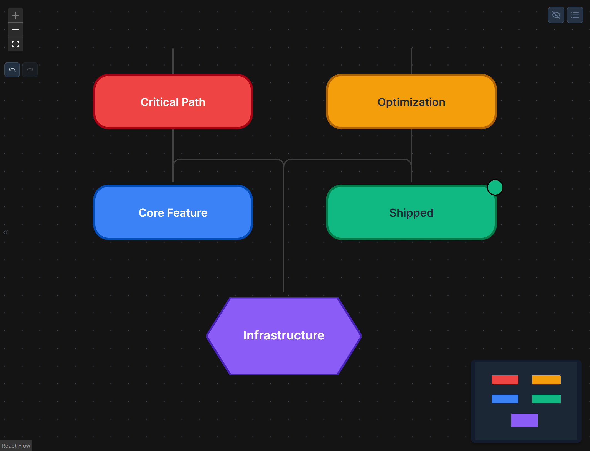

# Legends & Layers

Chart Hero provides two systems for organizing and annotating complex diagrams: **Legends** for documenting what colors and styles mean, and **Layers** for controlling visibility, locking, and z-ordering of groups of nodes.

---

## Legends

Legends are draggable overlay panels that sit on the canvas and document the meaning of colors, borders, pucks, edges, and swimlane lanes in your diagram. Chart Hero supports two independent legend overlays.

### Legend Types

| Legend | Purpose | Default Position | Default Title |
|--------|---------|-----------------|---------------|
| Node Legend | Document node fill colors, border styles, status puck colors, and edge colors | Top-left (50, 50) | Legend |
| Swimlane Legend | Document swimlane lane colors | Below the node legend (50, 300) | Swimlanes |

Both legends share the same property model and editing workflow. The only difference is what they describe and their default placement.

### Legend Items

Each legend contains an ordered list of items. Every item has the following properties.

| Property | Options | Description |
|----------|---------|-------------|
| Label | Any text | The description text displayed next to the swatch |
| Color | Any hex color | The swatch color |
| Kind | `fill`, `border`, `puck`, `edge`, `lane` | Controls how the swatch is rendered (filled square, border outline, circular puck, line segment, or lane bar) |
| Border Style | Solid, Dashed, Dotted | Applies only to `border`-kind items; controls the outline pattern of the swatch |
| Shape | Any shape name | Optional shape indicator next to the swatch |
| Icon | Any icon name | Optional icon indicator next to the swatch |
| Order | Number | Sort position within the legend (drag to reorder) |
| Hidden | Toggle | When enabled, the item is hidden from the canvas overlay but preserved in the editor |

### Creating Legends

**Manual Creation:**

1. Use the Legend panel controls in the Properties Panel to add a legend.
2. Add items one by one, choosing a color, label, and kind for each.
3. Position the legend by dragging its header on the canvas.

**Auto-Generate (Node Legend):**

The auto-generate feature scans your entire diagram and creates legend items automatically.

- Right-click the node legend on the canvas and select **Auto-Generate**.
- Chart Hero analyzes all nodes and edges, producing items for:
  - Unique node fill colors (one item per distinct color)
  - Unique border colors and styles (solid, dashed, dotted)
  - Unique status puck colors (mapped to status names)
  - Unique edge colors
- The swimlane legend is also populated from lane colors when auto-generating.

> **Tip:** Auto-generate replaces any existing legend items. If you have manually curated items, make sure to back them up or add them back after generating.

### Editing Legends on the Canvas

Legends are fully interactive on the canvas:

- **Drag the header** to reposition the legend anywhere on the canvas.
- **Double-click the title** to edit the legend title inline.
- **Double-click an item label** to edit its text inline.
- **Right-click the legend** to open a context menu with these options:
  - Edit Title
  - Edit Label
  - Add Item
  - Edit All Items (opens the full editor modal)
  - Auto-Generate
  - Hide Legend
  - Clear Legend

### Legend Editor Modal

For bulk editing, use the **Edit All Items** option to open a full editor modal. The modal provides a table view with:

- **Drag handles** on the left side of each row for reordering items
- **Color pickers** for changing each item's swatch color
- **Kind dropdown** for switching between fill, border, puck, edge, and lane rendering
- **Label text inputs** for editing descriptions
- **Visibility toggles** (eye icon) for showing or hiding individual items
- **Delete buttons** for removing items
- **Add Item** button at the bottom of the table for appending new items

### Legend Styling

Each legend has a set of style properties that control the appearance of the legend box itself.

| Property | Default | Description |
|----------|---------|-------------|
| Background Color | `#ffffff` | Legend box background fill |
| Border Color | `#e2e8f0` | Legend box border color |
| Border Width | 1 px | Border thickness around the legend box |
| Font Size | 11 px | Label text size for all items |
| Opacity | 1.0 (100%) | Legend transparency (0 = fully transparent, 1 = fully opaque) |
| Width | 180 px | Legend box width |

### Resizing

Drag the bottom-right corner handle of a legend to resize it. The font size scales proportionally with the legend width, keeping item labels readable at any size.

---

## Layers

Layers provide z-order management for organizing complex diagrams. Each node belongs to a layer, and layers control visibility, locking, and opacity for all nodes assigned to them.

### Layer Properties

| Property | Type | Default | Description |
|----------|------|---------|-------------|
| Name | Text | "Default" | Layer display name |
| Visible | Toggle | On | Show or hide all nodes on this layer |
| Locked | Toggle | Off | Prevent selecting or editing nodes on this layer |
| Opacity | 0 -- 1.0 | 1.0 | Transparency for all nodes on this layer (0 = invisible, 1 = fully opaque) |
| Color | Hex color | `#6366f1` | Layer identification color (used in the layer list UI) |
| Order | Number | Auto | Layer stacking order (higher = rendered on top) |

### Default Layer

Every diagram starts with a single layer named **Default**. This layer cannot be deleted -- at least one layer must always exist. If you attempt to remove the last remaining layer, the action is silently ignored.

### Managing Layers

All layer operations are available through the Layers panel.

- **Add Layer** -- Creates a new layer. The new layer is appended above the current top layer with the next available order index.
- **Remove Layer** -- Deletes a layer and re-indexes the remaining layers. You cannot delete the last remaining layer. If the active layer is removed, the first remaining layer becomes active.
- **Reorder Layers** -- Drag layers in the list to change their stacking order. Nodes on higher-order layers render on top of nodes on lower-order layers.
- **Set Active Layer** -- Click a layer to make it the active layer. All newly created nodes are placed on the active layer.
- **Toggle Visibility** -- Click the eye icon to hide or show all nodes on a layer. Hidden nodes are excluded from the canvas but remain in the diagram data.
- **Toggle Lock** -- Click the lock icon to lock or unlock a layer. Nodes on a locked layer cannot be selected, moved, or edited, protecting them from accidental changes.
- **Set Opacity** -- Adjust the opacity slider to fade a layer. The value is clamped to the 0 -- 1 range. This is useful for dimming background content while you focus on foreground elements.
- **Merge Down** -- Merges a layer into the layer directly below it. All nodes from the merged layer are reassigned to the target layer, and the merged layer is removed. You cannot merge the bottom-most layer (there is nothing below it to merge into). If the merged layer was active, the target layer becomes the new active layer.

### Layer Use Cases

Layers are most valuable in diagrams that contain many nodes or serve multiple purposes. Here are some common patterns.

**Foreground and Background Separation**

Place decorative elements, watermarks, or background shapes on a lower layer. Lock that layer so you can freely edit the foreground without accidentally moving background elements.

**Draft and Final Content**

Keep exploratory or draft ideas on a separate layer. Toggle its visibility off when you want a clean view of the final diagram, and toggle it back on when you want to revisit alternatives.

**Annotations and Review Comments**

Create a dedicated "Annotations" layer for review comments, callout text boxes, or sticky notes. Lock the layer after the review is complete to preserve the annotations, or hide it for a clean export.

**Presentation Views**

Assign different parts of a diagram to different layers to create presentation-style views. Before presenting, toggle only the relevant layers to visible. This lets you progressively reveal complexity without duplicating the diagram.

**Opacity for Focus**

Set background layers to low opacity (for example, 0.2) while working on a specific layer. This keeps surrounding context visible for alignment without the visual noise of full-opacity elements.
