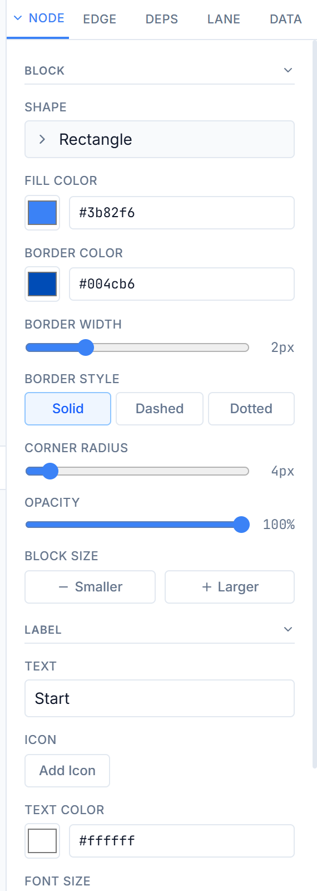

# Properties Panel

The Properties Panel is the collapsible right-side panel that provides detailed editing controls for whatever is currently selected on the canvas. It contains five tabs and adapts its content based on your selection.

**Toggle visibility:** Click the panel toggle button in the toolbar to show or hide the Properties Panel.

---

## Panel Tabs

The panel header shows five tabs. The active tab switches automatically when your selection changes (for example, selecting a node activates the Node tab; selecting a connector activates the Edge tab).

| Tab | Label | Shows When |
|-----|-------|------------|
| **Node** | Node | One or more nodes are selected |
| **Edge** | Edge | One or more connectors are selected |
| **Deps** | Deps | Any time (dependency chain tools) |
| **Lane** | Lane | Any time (swimlane configuration) |
| **Data** | Data | A node or connector is selected (metadata view) |

---

## Node Tab

The Node tab appears when one or more nodes are selected. It is organized into four collapsible sections: **Block**, **Label**, **Icon**, and **Status Pucks**.

**Collapse/expand behavior:**

- Click any section header to collapse or expand that section.
- Double-click the chevron on the tab header row to expand or collapse **all** sections at once.
- Sections auto-expand based on the selected node's properties. For example, the Icon section only auto-expands if the node has an icon set, and the Status Pucks section auto-expands if the node has pucks.

**Multi-node editing:** When multiple nodes are selected, changes made in the Node tab apply to all selected nodes simultaneously.

---

### Block Section

Controls the shape's visual appearance -- fill, border, size, and opacity.

| Control | Type | Range | Default | Description |
|---------|------|-------|---------|-------------|
| Shape | Read-only | -- | -- | Displays the current shape name (e.g., "rectangle", "diamond") |
| Fill Color | Color picker + hex input | Any hex | `#3b82f6` | Node background fill color |
| Border Color | Color picker + hex input | Any hex | Auto-darkened from fill | Border/outline color |
| Border Width | Slider | 0 -- 8 px (0.5 px steps) | 2 px | Border stroke thickness |
| Border Style | 3 buttons | Solid / Dashed / Dotted | Solid | Border dash pattern |
| Corner Radius | Slider | 0 -- 50 px | 4 px | Rounded corner radius |
| Opacity | Slider | 0 -- 100% (5% steps) | 100% | Node transparency |
| Block Size | 2 buttons | Smaller / Larger | -- | Quick resize: Smaller decreases width by 20 px and height by 15 px; Larger increases by the same amounts |

---

### Label Section

Controls the node's text label, icon attachment, and typography.

| Control | Type | Range | Default | Description |
|---------|------|-------|---------|-------------|
| Text | Text input | Any text | -- | Node label text. Use `\n` to insert line breaks |
| Icon | Button + picker | 1000+ Lucide icons | (none) | Opens an icon picker to add, change, or remove an icon. Shows a preview of the current icon |
| Icon Position | 2 buttons | Left / Right | Left | Icon placement relative to the label text |
| Text Color | Color picker + hex input | Any hex | `#ffffff` | Label text color |
| Font Size | Slider + increment/decrement buttons | 8 -- 32 px | 14 px | Label font size. The decrement and increment buttons adjust by 1 px |
| Font Weight | 4 buttons | Light (300) / Normal (400) / Semi (600) / Bold (700) | 500 | Text weight |
| Text Align | 3 icon buttons | Left / Center / Right | Center | Horizontal text alignment within the node |

---

### Icon Section

This section only appears when the selected node has an icon set. It controls the icon's color, background, outline, and sizing independently from the label text.

| Control | Type | Range | Default | Description |
|---------|------|-------|---------|-------------|
| Icon Color | Color picker + hex input | Any hex | Inherits text color | Icon stroke color. A **Reset** button appears when a custom color is set |
| Background | Color picker + hex input | Any hex | (none) | Solid background behind the icon. A **Clear** button removes it |
| Outline Color | Color picker + hex input | Any hex | (none) | Border color around the icon |
| Outline Width | Slider | 0 -- 4 px (0.5 px steps) | 0 px | Icon border thickness |
| Size | Slider | 10 -- 64 px | Auto (font size + 2) | Icon dimensions. An **Auto** button appears when a custom size is set, resetting to the automatic size |

---

### Status Pucks Section

This section auto-expands when the selected node has status pucks. It provides a full multi-puck editor.

**Adding pucks:** Click the **+** button next to the section header to add a new puck with default values (not-started status, `#94a3b8` color, 12 px size, top-right position).

**Selecting pucks:** Click a puck chip (colored circle) to select it for editing. The detail editor below shows controls for the selected puck.

**Bulk selection:**

- **Select All on Node** -- selects all pucks on the current node
- **Select All (Global)** -- selects all pucks across every node in the diagram

When 2 or more pucks are selected, a blue indicator shows the count and confirms that changes apply to all selected pucks.

**Removing pucks:** Hover over a puck chip to reveal a small red X button that removes it.

#### Puck Detail Editor

| Control | Type | Range / Options | Default | Description |
|---------|------|-----------------|---------|-------------|
| Status | Dropdown | Not Started / In Progress / Completed / Blocked / Review | Not Started | Status type. Changing status auto-suggests a default color |
| Indicator Color | Color picker + hex input | Any hex | `#94a3b8` | Puck fill color |
| Indicator Size | Slider | 8 -- 20 px | 12 px | Puck diameter |
| Position | 4 buttons | TL / TR / BL / BR | TR (top-right) | Corner placement on the node |
| Puck Icon | Dropdown | Default (Auto), Blank (No Icon), Checkmark, Clock, X Mark, Eye, Warning, Star, Heart, Flag, Lightning, Thumbs Up, Thumbs Down, Circle, Square, Bell, Bookmark, Pin | Default (Auto) | Icon rendered inside the puck |
| Border Color | Color picker + hex input | Any hex | `#000000` | Puck border color |
| Border Width | Slider | 0 -- 4 px (0.5 px steps) | 1 px | Puck border thickness |
| Border Style | 4 buttons | Solid / Dashed / Dotted / None | Solid | Puck border dash pattern |

**Default status colors:**

| Status | Color |
|--------|-------|
| Not Started | `#94a3b8` (slate) |
| In Progress | `#3b82f6` (blue) |
| Completed | `#10b981` (green) |
| Blocked | `#ef4444` (red) |
| Review | `#f59e0b` (amber) |

---

## Edge Tab

The Edge tab appears when one or more connectors are selected. It is organized into four collapsible sections: **Style**, **Label**, **Arrowheads**, and **Dependency**.

Sections auto-expand based on the selected edge's properties. For example, the Label section auto-expands if the connector has a label set, and the Arrowheads section auto-expands if non-default markers are applied.

**Multi-edge editing:** When multiple connectors are selected, changes apply to all selected connectors simultaneously.

---

### Style Section

| Control | Type | Range / Options | Default | Description |
|---------|------|-----------------|---------|-------------|
| Connector Type | Dropdown | SmoothStep / Bezier / Step / Straight | SmoothStep | Routing algorithm (also changeable by drag-to-cycle on the connector body) |
| Connector Color | Color picker + hex input | Any hex | `#94a3b8` | Line stroke color |
| Thickness | Slider | 1 -- 6 px (0.5 px steps) | 2 px | Line stroke width |
| Opacity | Slider | 0 -- 100% (5% steps) | 100% | Line transparency |
| Line Style | 3 buttons | Solid / Dashed / Dotted | Solid | Dash pattern for the line |
| Dash Spacing | Slider | 2 -- 16 px (dotted) or 4 -- 24 px (dashed) | Auto | Gap size between dashes or dots. Only visible when Line Style is not Solid |

---

### Label Section

This section auto-expands when the selected connector has a label.

| Control | Type | Range / Options | Default | Description |
|---------|------|-----------------|---------|-------------|
| Label | Text input | Any text | (none) | Connector label text |
| Label Color | Color picker + hex input | Any hex | `#475569` | Label text color. Only visible when a label is set |
| Label Font Size | Slider | 8 -- 24 px | 11 px | Label text size. Only visible when a label is set |
| Label BG Color | Color picker + hex input | Any hex | `#ffffff` | Label background color. Only visible when a label is set |

> **Tip:** Labels can also be repositioned by dragging them along the connector path directly on the canvas. See [Connectors & Edges](connectors-edges.md) for details.

---

### Arrowheads Section

This section auto-expands when non-default markers are applied.

| Control | Type | Options | Default | Description |
|---------|------|---------|---------|-------------|
| Start (Source) | Dropdown | None / Arrow / Diamond / Circle / Open Arrow | None | Marker shape at the source end |
| End (Target) | Dropdown | None / Arrow / Diamond / Circle / Open Arrow | Arrow | Marker shape at the target end |

---

### Dependency Section

This section auto-expands when a dependency type is set.

| Control | Type | Options | Default | Description |
|---------|------|---------|---------|-------------|
| Dependency Type | Dropdown | None / Depends On / Blocks / Related | None | Relationship type for dependency tracking |

---

## Dependencies Tab

The Dependencies tab is rendered by the `DependencyPanel` component. It provides tools for visualizing and navigating dependency chains within the diagram.

This tab is always available regardless of selection. It shows:

- Dependency chain visualization for the currently selected node
- Controls for dependency walk mode (stepping through chains)
- Quick-link mode for rapidly creating dependency connections between nodes

> For full documentation on dependency features, see [Status Pucks and Dependencies](status-pucks-dependencies.md).

---

## Lane Tab

The Lane tab provides full swimlane configuration. It is always available regardless of selection.

From this tab you can:

- Set the swimlane orientation (Horizontal, Vertical, or Matrix)
- Add, remove, reorder, and rename lanes
- Configure lane colors, container title, and border styles
- Adjust divider styling and label appearance

> For full documentation on swimlane features, see [Swimlanes and Banners](swimlanes-banners.md).

---

## Data Tab

The Data tab shows metadata and allows notes for the selected item. Its content changes depending on whether a node or a connector is selected.

### Node Data View

Shown when a node is selected.

| Field | Type | Description |
|-------|------|-------------|
| Node ID | Read-only + copy button | Unique identifier for the node |
| Position | Read-only | X, Y coordinates on the canvas |
| Dimensions | Read-only | Width x Height in pixels |
| Swimlane | Read-only | Name of the assigned swimlane, or "None" |
| Connected To | Read-only list | All nodes connected to this node by any connector |
| Upstream - Prerequisites | Read-only list (blue) | Nodes this node depends on (from `dependsOn` data) |
| Downstream - Enables | Read-only list (amber) | Nodes that depend on this node (from `blockedBy` data) |
| Start On | Date input | Planned start date |
| Completed By | Date input | Target completion date |
| Notes | Textarea | Free-form notes (saved on blur) |

### Edge Data View

Shown when a connector is selected.

| Field | Type | Description |
|-------|------|-------------|
| Edge ID | Read-only + copy button | Unique identifier for the connector |
| Type | Read-only | Connector type (e.g., "smoothstep") |
| Source | Read-only | Source node label and ID |
| Target | Read-only | Target node label and ID |
| Label | Read-only | Connector label text (if set) |
| Notes | Textarea | Free-form notes (saved on blur) |

---

## Related Pages

- [Connectors & Edges](connectors-edges.md) -- Connector types, arrowheads, and edge behavior
- [Shapes and Nodes](shapes-nodes.md) -- All 27 shapes and their properties
- [Status Pucks and Dependencies](status-pucks-dependencies.md) -- Puck system and dependency chains
- [Swimlanes and Banners](swimlanes-banners.md) -- Swimlane configuration details
- [Toolbar Reference](toolbar-reference.md) -- Toolbar buttons that interact with the Properties Panel
