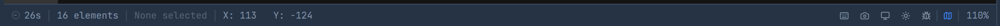
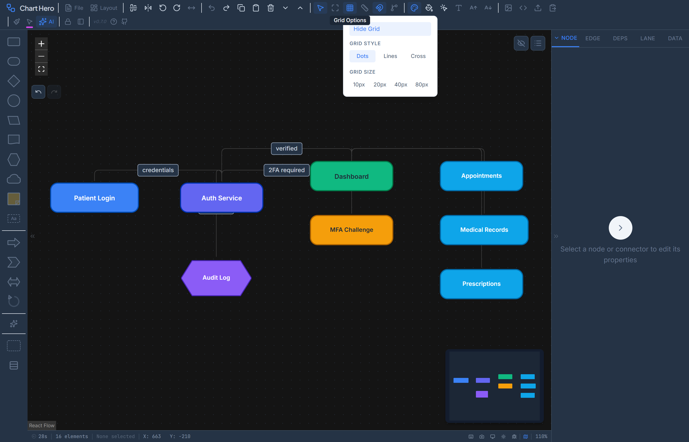
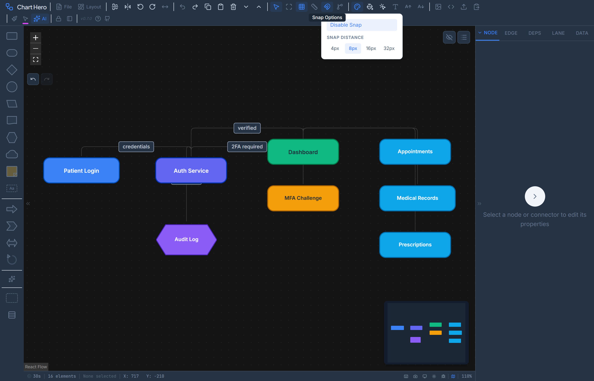

# Settings & Preferences

Chart Hero persists all configurable options in your browser's localStorage under the key `charthero-settings`. Settings survive page reloads, browser restarts, and updates. You can export them to a JSON file and import them on another machine.

Settings are accessed through the **Settings** dialog (gear icon) or modified indirectly via toolbar controls. Changes take effect immediately -- there is no "Apply" step.



---

## Canvas Settings

These control the visual grid overlay and the snapping behavior of the canvas background.

| Setting | Type | Default | Description |
|---------|------|---------|-------------|
| Grid Visible | Toggle | On | Show the grid overlay on the canvas |
| Grid Spacing | Number | 16px | Distance between grid points or lines |
| Grid Color | Color | `#e2e8f0` | Color of grid dots, lines, or crosses |
| Snap to Grid | Toggle | On | Constrain node movement to grid positions when dragging |
| Snap Distance | Number | 8px | How close a node must be to a grid point before it snaps |
| Background Color | Color | `#ffffff` | Canvas background fill color |
| Show Dots | Toggle | On | Use dot-style grid (when off, falls back to lines) |





> Grid visibility and snap-to-grid are independent. Snap works even when the grid is hidden, and the grid can be displayed without snap enabled.

The toolbar provides quick toggles for grid visibility (Grid button) and snap (Magnet button). The Settings dialog exposes the full set of controls including color and spacing.

---

## Node Defaults

Default properties applied to every newly created node. Existing nodes are not affected when you change these defaults.

| Setting | Type | Default | Description |
|---------|------|---------|-------------|
| Shape | Selection | `roundedRectangle` | Default shape for new nodes |
| Width | Number | 160px | Default node width |
| Height | Number | 60px | Default node height |
| Color | Color | `#ffffff` | Default fill color |
| Border Color | Color | `#94a3b8` | Default border color |
| Border Width | Number | 1px | Default border thickness |
| Border Radius | Number | 8px | Default corner rounding |
| Text Color | Color | `#1e293b` | Default label text color |
| Font Size | Number | 14px | Default label font size |
| Font Family | Selection | `Inter, system-ui, sans-serif` | Default font stack |

When a diagram style is applied, it overrides the visual appearance of all existing nodes but does not change these stored defaults. Nodes created after applying a style use the style's appearance rather than these values.

---

## Edge Defaults

Default properties applied to every newly created connector (edge).

| Setting | Type | Default | Description |
|---------|------|---------|-------------|
| Type | Selection | `smoothstep` | Default connector routing algorithm |
| Color | Color | `#94a3b8` | Default edge stroke color |
| Width | Number | 1.5px | Default line thickness |
| Animated | Toggle | Off | Whether new edges show a moving dash animation |
| Marker Start | Selection | `none` | Arrowhead at the source end (`none`, `arrow`, `arrowclosed`) |
| Marker End | Selection | `arrowclosed` | Arrowhead at the target end (`none`, `arrow`, `arrowclosed`) |
| Label Font Size | Number | 12px | Default font size for edge labels |
| Label Background | Toggle | On | Show a background rectangle behind edge labels |

Available edge types:

| Type | Routing |
|------|---------|
| `default` | React Flow default (bezier) |
| `bezier` | Smooth cubic bezier curve |
| `smoothstep` | Rounded right-angle path (default) |
| `step` | Sharp right-angle path |
| `straight` | Direct line between endpoints |

---

## Interaction Settings

Fine-tune how the canvas responds to mouse, keyboard, and touch input.

| Setting | Type | Default | Description |
|---------|------|---------|-------------|
| Multi-Select Key | Selection | `shift` | Modifier key for adding to the selection (`shift`, `ctrl`, `meta`) |
| Pan on Drag | Toggle | On | Left-click drag on empty canvas pans the viewport (when enabled, hold Ctrl to pan; default is selection drag) |
| Pan on Scroll | Toggle | Off | Scroll wheel pans instead of zooming |
| Zoom on Scroll | Toggle | On | Scroll wheel zooms the canvas |
| Zoom on Pinch | Toggle | On | Pinch gesture zooms on touch devices |
| Zoom on Double-Click | Toggle | Off | Double-clicking empty space zooms in |
| Min Zoom | Number | 0.1 (10%) | Lowest allowed zoom level |
| Max Zoom | Number | 4 (400%) | Highest allowed zoom level |
| Fit View on Init | Toggle | On | Automatically fit the diagram to the viewport when first loaded |
| Connection Mode | Selection | `loose` | `strict` requires dropping on an exact handle; `loose` connects to the nearest handle |
| Connection Line Type | Selection | `smoothstep` | Preview line style shown while dragging a new connection |

---

## Auto-Save

Auto-save is always active and requires no configuration. Chart Hero saves your nodes and edges to localStorage within one second of every change. If something goes wrong, you can recover by reopening the browser tab -- your diagram will be restored automatically.

> Auto-save is separate from manual save (`Ctrl+S`), which downloads a full `.fc` file to disk including swimlanes, legends, styles, and viewport state.

---

## Accessibility Settings

| Setting | Type | Default | Description |
|---------|------|---------|-------------|
| High Contrast | Toggle | Off | Increase contrast across all UI elements |
| Reduced Motion | Toggle | Off | Disable animated edges, transitions, and other motion effects |
| Keyboard Navigation | Toggle | On | Full keyboard navigation between nodes, edges, and panels |
| Screen Reader Announcements | Toggle | On | Announce diagram actions via ARIA live regions |
| Focus Indicator Width | Number | 2px | Width of the keyboard-focus outline ring |

---

## Toolbar Configuration

| Setting | Type | Default | Description |
|---------|------|---------|-------------|
| Group Order | Array | `file, arrange, edit, view, panels, export` | Arrangement of toolbar button groups |
| Locked | Toggle | On | Prevent accidental drag-reordering of button groups |
| Orientation | Selection | `horizontal` | Toolbar position: `horizontal` (top edge) or `vertical` (left edge) |

### Reordering Toolbar Groups

1. Click the **Lock** icon at the far right of the toolbar to unlock it
2. Drag the grip handle on any button group to move it to a new position
3. Click **Lock** again to save the arrangement

The Lock and Orientation buttons are always pinned to the far right (horizontal) or bottom (vertical) of the toolbar and cannot be reordered.

---

## UI State (Runtime)

These values control the current session's interface layout. They reset to their defaults when you reload the page because they are stored in memory, not localStorage.

| Setting | Default | Description |
|---------|---------|-------------|
| Shape Palette Open | On | Left-side shape palette visibility |
| Properties Panel Open | On | Right-side properties panel visibility |
| Minimap Visible | On | Small navigator overlay in the canvas corner |
| Grid Visible | On | Grid overlay (mirrors the persisted canvas setting on load) |
| Snap Enabled | On | Snap-to-grid (mirrors the persisted canvas setting on load) |
| Grid Style | `dots` | Visual grid style: `dots`, `lines`, or `cross` |
| Ruler Visible | Off | Pixel rulers along the top and left canvas edges |
| Alignment Guides | On | Show alignment guides when dragging nodes near other nodes. Hold Shift while dragging to snap to guides |
| Distribution Guides | On | Show equal-spacing guides when positioning three or more nodes |
| Selection Color | `#d946ef` (magenta) | Highlight color for selected nodes, edges, and pucks |
| Selection Thickness | 2px | Width of the selection outline |

---

## Debug Mode

Toggle via the **Bug** icon in the toolbar (far-right utility area). When debug mode is active the icon highlights and Chart Hero writes detailed logs to the browser developer console.

What gets logged:

- Node and edge CRUD operations (add, update, delete)
- Store state changes across all Zustand stores
- Settings import/export events
- Layout engine calculations

Debug mode is persisted in localStorage, so it survives page reloads. Toggle it off the same way you turned it on.

**To view logs:** Open the browser developer tools (`F12` or `Ctrl+Shift+I`), switch to the **Console** tab, and look for entries prefixed with `[ChartHero]`.

---

## Presentation Mode

Enter via the **Monitor** icon in the toolbar. Presentation mode is designed for screen-sharing and live walkthroughs of your diagram.

### What Changes

- The toolbar, shape palette, and properties panel are hidden
- The browser enters fullscreen
- All editing interactions (drag to move, resize handles, connection handles) are disabled
- A floating toolbar appears with annotation tools

### Annotation Tools

| Tool | Behavior |
|------|----------|
| **Pointer** | Default cursor, no drawing |
| **Pen** | Draw freehand red strokes (2.5px, full opacity) |
| **Highlighter** | Draw wide translucent yellow strokes (16px, 35% opacity) |
| **Eraser** | Click a stroke to remove it |

Additional controls in the floating toolbar:

- **Undo** -- Remove the last drawn stroke
- **Clear All** -- Erase all annotations
- **Screenshot** -- Capture the current view as a PNG
- **Download** -- Save annotations with the diagram
- **Zoom In / Out** -- Adjust the viewport
- **Fit** -- Reset the viewport to show the full diagram

### Exiting

Press `Escape` or click the **X** button in the floating toolbar. The browser exits fullscreen and all panels are restored. Annotations drawn during presentation mode are discarded unless you explicitly download them.

---

## PWA and Offline Support

Chart Hero is a Progressive Web App. After the first visit, all application assets are cached locally, so you can use Chart Hero without an internet connection.

### Installing as a Desktop App

- Click **File > Install as App** in the toolbar (available in Chromium-based browsers)
- Or use your browser's built-in install prompt (address bar icon or menu item)
- The install option is grayed out when the browser does not support PWA installation or Chart Hero is already installed

Once installed, Chart Hero launches in its own window without browser chrome and appears in your operating system's application list.

### What Works Offline

- Full diagramming (all 26 shapes, drag-and-drop, connections)
- All 19 diagram themes and 11 color palettes
- Export to PNG, SVG, PDF, PPTX, and JSON
- Auto-save and manual save
- Settings, keyboard shortcuts, presentation mode

### What Requires Internet

- The AI Assistant (sends requests to the configured AI provider API)

### Data Storage

All data stays in your browser:

| Data | Storage | Cleared By |
|------|---------|------------|
| Settings | localStorage (`charthero-settings`) | Clearing site data or resetting defaults |
| Auto-save slots | localStorage | Clearing site data |
| AI provider API keys | sessionStorage (default) or localStorage (if opted in) | Closing the tab (session) or clearing site data (opted in) |
| Diagram files | Downloaded `.fc` files on disk | User action |

No data is ever sent to a Chart Hero server. The only network traffic is PWA asset caching and, when configured, AI provider API calls that go directly from your browser to the provider (OpenAI, Anthropic, Google, etc.).

---

## Format Painter

The Format Painter copies visual styling from one element and applies it to others, saving time when you want consistent formatting.

### Single-Apply Mode

1. Select a styled node or edge
2. Click the **Format Painter** button (paint-bucket icon) in the toolbar
3. Click a target node or edge -- the style is applied and the painter deactivates

### Persistent Mode

1. Select a styled node or edge
2. **Double-click** the Format Painter button
3. Click as many targets as you want -- each receives the copied style
4. Press `Escape` to deactivate, or click the Format Painter button again

### Keyboard Shortcuts

| Shortcut | Action |
|----------|--------|
| `Ctrl+Alt+C` | Copy style from the selected element |
| `Ctrl+Shift+V` | Paste the copied style onto the selected element |

### What Gets Copied

**Node style properties:** fill color, border color, text color, font size, font weight, font family, border style, border width, border radius, opacity, text alignment.

**Edge style properties:** color, thickness, opacity, dash pattern, label color.

> Format Painter copies only visual properties. It does not copy labels, icons, status pucks, size, or position.

---

## Link Groups

Link groups bind multiple nodes together so they move as a unit when any member is dragged. Unlike visual groups (container nodes), link groups have no visible boundary -- they are a purely logical association.

### Creating a Link Group

1. Select two or more nodes
2. Right-click and choose **Group > Link Group**, or press `Ctrl+Shift+G`
3. The nodes are now linked -- dragging any one moves them all

### Managing Link Groups

When you create or select a link group, the **Link Group Editor** dialog appears in the top-right corner of the canvas.

| Action | How |
|--------|-----|
| **Select a member** | Click its row in the editor to select it on the canvas |
| **Add nodes** | Click the **Add Nodes** button, then click unlinked nodes on the canvas |
| **Remove a node** | Hover a member row and click the **X** button that appears |
| **Dissolve the group** | Click the **Dissolve** button to unlink all members |

Press `Escape` to close the editor (or to stop the add-nodes mode if it is active).

### Behavior

- Dragging any node in a link group moves every member by the same offset
- Each node retains its own individual properties (shape, color, size, label, etc.)
- A node can belong to only one link group at a time
- Link groups are included in `.fc` file exports and JSON round-trips

---

## Resetting and Transferring Settings

### Reset

| Action | Effect |
|--------|--------|
| **Reset Tab Defaults** | Restore a single settings category (Canvas, Node Defaults, etc.) to its factory values |
| **Reset All Defaults** | Restore every setting to factory values in one step |

Resetting does not affect your current diagram -- only the stored defaults change.

### Export and Import

| Action | Effect |
|--------|--------|
| **Export Settings** | Save all current settings as a JSON file |
| **Import Settings** | Load a previously exported JSON file, overwriting current settings |

This is useful for sharing a consistent configuration across team members or moving your preferences to a new browser.

The exported JSON contains six top-level keys matching the settings groups:

```json
{
  "canvas": { ... },
  "nodeDefaults": { ... },
  "edgeDefaults": { ... },
  "interaction": { ... },
  "autoSave": { ... },
  "accessibility": { ... }
}
```

Partial imports are supported. If the JSON file contains only some groups, only those groups are overwritten; the others keep their current values.
