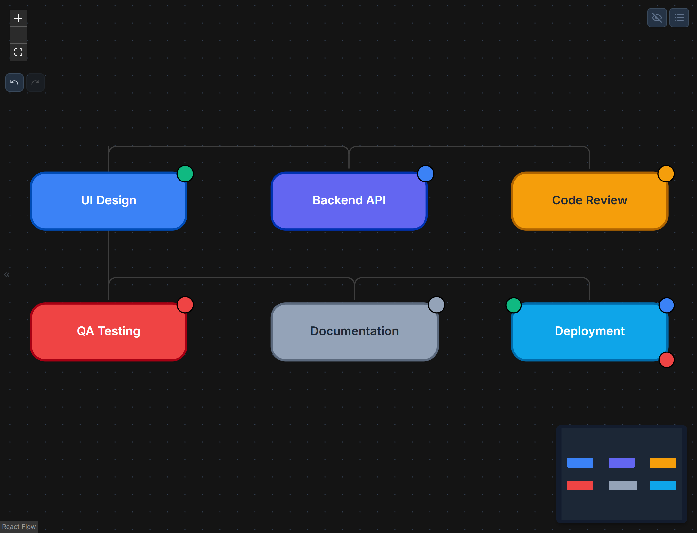
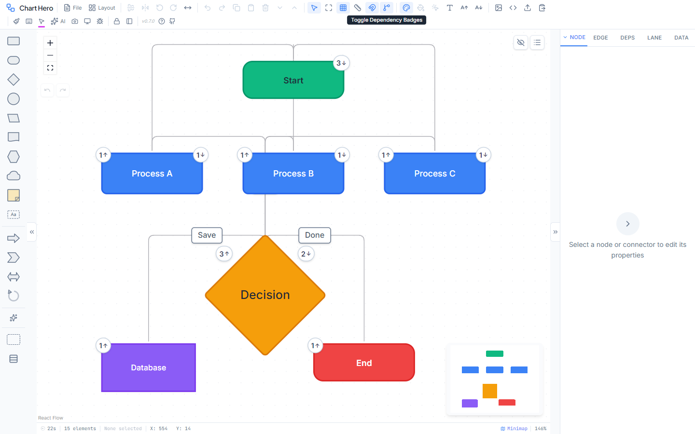

# Status Pucks & Dependencies

Chart Hero has two powerful systems for tracking project state: **Status Pucks** (visual badges on nodes) and **Dependencies** (relationship tracking between nodes). Together they turn a static diagram into a living project tracker.

---

## Status Pucks

Status pucks are small colored indicator badges that appear on node corners. Each node can have **multiple** pucks simultaneously, letting you track several dimensions of status on a single node.

### Adding Pucks

There are three ways to add a status puck to a node:

1. **Properties Panel** -- Select a node, open the Node tab, expand the Status Pucks section, and click the **+** button.
2. **Context Menu** -- Right-click a node and choose **Add Status**. A submenu lists the five status types and you can pick one to add immediately.

3. **AI Assistant** -- Describe what you need in natural language, for example: `"Add an in-progress status puck to the Build node"`.

### Puck Properties

Every puck exposes the following configurable properties in the Properties Panel.

| Property | Options | Default | Description |
|----------|---------|---------|-------------|
| Status | Not Started, In Progress, Completed, Blocked, Review | Not Started | Status type (auto-sets default color) |
| Color | Any hex color | Depends on status (see below) | Puck fill color |
| Size | 8 -- 20 px (1 px steps) | 12 px | Puck diameter |
| Position | Top-Left, Top-Right, Bottom-Left, Bottom-Right | Top-Right | Corner placement on the node |
| Icon | Default (Auto), Blank, Checkmark, Clock, X Mark, Eye, Warning, Star, Heart, Flag, Lightning, Thumbs Up, Thumbs Down, Circle, Square, Bell, Bookmark, Pin | Default (Auto) | Icon rendered inside the puck |
| Border Color | Any hex color | `#000000` | Puck outline color |
| Border Width | 0 -- 4 px (0.5 px steps) | 1 px | Outline thickness |
| Border Style | Solid, Dashed, Dotted, None | Solid | Outline style |

### Default Status Colors

When you add or change a puck status, Chart Hero automatically applies a default color. You can override this with any hex color afterward.

| Status | Default Color | Hex |
|--------|--------------|-----|
| Not Started | Gray | `#94a3b8` |
| In Progress | Blue | `#3b82f6` |
| Completed | Green | `#10b981` |
| Blocked | Red | `#ef4444` |
| Review | Amber | `#f59e0b` |

### Multi-Puck Editing

When a node has multiple pucks, the Properties Panel shows each puck as a small colored chip. Selecting chips lets you edit one or many at once.

- **Click a chip** to select that puck for editing. The property fields below update to show its current values.
- **Shift+click a chip** to add it to the current selection without deselecting others.
- **Select All on Node** button selects every puck on the currently selected node.
- **Select All (Global)** button selects all matching pucks across every node in the diagram.
- When multiple pucks are selected, any property change applies to **all** of them simultaneously. This is the fastest way to recolor or resize a batch of pucks.

### Puck Interactions on the Canvas

You can also interact with pucks directly on the canvas without opening the Properties Panel.

- **Click a puck** -- Selects the puck (deselects any selected nodes or edges).
- **Shift+click a puck** -- Adds the puck to the current selection.
- **Drag a puck** -- Moves the puck to snap to a different corner of its parent node.
- **Ctrl+drag a puck** -- Resizes the puck by dragging.
- **Right-click a puck** -- Opens a context menu with bulk selection options:
  - On this node (all pucks on the same node)
  - Same color (all pucks with matching fill color)
  - Same outline (all pucks with matching border)
  - All pucks (every puck in the diagram)

> **Tip:** When multiple pucks share the same corner, they automatically offset horizontally so they remain visible.

---

## Dependencies

Dependencies create directed relationships between nodes, enabling you to track workflows, blockers, and prerequisites within your diagram.

### Creating Dependencies

There are three ways to add a dependency:

1. **Properties Panel** -- Select an edge, open the Edge tab, and set the **Dependency Type** dropdown.
2. **Quick-Link Mode** -- Open the Dependencies panel and toggle Quick-Link Mode. Then click a source node followed by a target node to create a dependency link between them.
3. **AI Assistant** -- Use natural language, for example: `"Add a depends-on relationship from Deploy to Build"`.

### Dependency Types

| Type | Meaning | Visual |
|------|---------|--------|
| Depends On | The target cannot proceed until the source is complete | Directional arrow |
| Blocks | The source actively prevents the target from proceeding | Blocking indicator |
| Related | A non-directional relationship with no ordering implication | Dashed connector |

### Dependency Panel Toggles

The Dependencies panel (accessible from the toolbar) provides several toggles that overlay additional information on your diagram.

#### Dependency Badges

Toggle with the **GitBranch** icon in the toolbar. When enabled, every node that participates in a dependency shows two small counters:

- **In-count** -- The number of upstream dependencies (edges coming in).
- **Out-count** -- The number of downstream dependents (edges going out).

#### Dependency Labels

When enabled, each dependency edge displays its type as a text label along the connector: **Depends On**, **Blocks**, or **Related**.

#### Ready / Blocked Indicators

Toggle to highlight node readiness state based on upstream dependencies:

- **Ready** -- All upstream dependencies have a Completed status puck. The node is clear to proceed.
- **Blocked** -- One or more upstream dependencies are incomplete or have a Blocked puck.

#### Orphan Highlighting

Toggle to highlight nodes with **no dependencies** (isolated nodes that have zero dependency edges). This is useful for finding disconnected parts of a workflow that may need to be linked.

### Critical Path

- **Toggle:** Enabled by default.
- **Behavior:** Highlights the longest dependency chain in the diagram. This is the path that determines the overall project duration.
- **Critical Path Color:** Configurable (default `#e53e3e`). Change the color in the Dependencies panel.
- **Purpose:** Helps you identify bottleneck paths in project workflows so you know where delays will cascade.

### Walk Mode (Step-Through)

Walk Mode lets you step through a dependency chain node by node, which is useful for tracing execution order, reviewing pipelines, or presenting workflows to a team.

1. Enable **Walk Mode** in the Dependencies panel.
2. Click a starting node on the canvas. The dependency chain from that node highlights.
3. Step **forward** through downstream nodes or **backward** through upstream nodes using the walk controls.
4. The current node and its connecting path are visually emphasized on the canvas.
5. Click **Stop** or toggle Walk Mode off to exit.

> **Tip:** Walk Mode works best when your dependency chain is linear or has a clear longest path. In branching chains, the walk follows the critical path by default.

### Data Tab -- Dependency Information

When a node is selected, the **Data** tab in the Properties Panel shows three relationship lists for that node:

- **Connected To** -- All nodes connected to this node by any edge, regardless of dependency type. Displays the count in parentheses.
- **Upstream -- Prerequisites** -- Nodes that this node depends on (blue highlighting). These are the nodes that must complete before the selected node can proceed.
- **Downstream -- Enables** -- Nodes that depend on the selected node (amber highlighting). Completing the selected node unblocks these downstream nodes.

Each entry in these lists is clickable -- clicking a node name selects that node on the canvas and scrolls to it.
