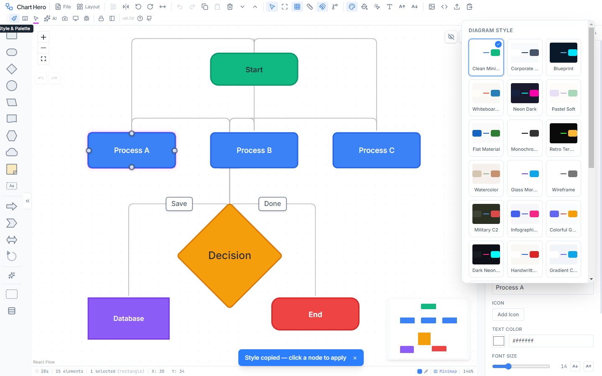

# Styles & Themes

Chart Hero offers 29 visual diagram themes and 21 color palettes that let you completely transform the look of your diagram with a single click. Access them via the **Paintbrush** icon in the toolbar.

---

## Diagram Styles (29 Themes)

Each style completely transforms the visual appearance of your diagram: canvas background, grid style, node fills, borders, fonts, edge colors, and accent palette. Applying a style updates every node and edge on the canvas at once.

<h4>Light Themes (15)</h4>

<button class="theme-nav prev" aria-label="Previous">&#8249;</button>

Clean Minimal

Inter &middot; Crisp, modern, professional

Corporate Professional

Georgia &middot; Business reports

Pastel Soft

Nunito &middot; Friendly, approachable

Flat Material

Roboto &middot; Material Design

Watercolor

Lora &middot; Artistic, hand-crafted

Whiteboard Sketch

Caveat &middot; Hand-drawn look

Monochrome Ink

IBM Plex Mono &middot; High-contrast

Wireframe

Inter &middot; Mockup prototyping

Infographic Bold

Poppins &middot; Eye-catching

Colorful Gradient

Inter &middot; Vibrant presentations

Zinc Modern

Inter &middot; Ultra-clean SaaS

Soft Gradient

Inter &middot; Modern editorial pastel

Paper Print

Georgia &middot; Book typography

macOS Aqua

SF Pro Display &middot; Clean Apple design

Claude

Inter &middot; Warm terracotta tones

<button class="theme-nav next" aria-label="Next">&#8250;</button>

<h4>Dark Themes (11)</h4>

<button class="theme-nav prev" aria-label="Previous">&#8249;</button>

Blueprint

JetBrains Mono &middot; Technical blueprint

Neon Dark

JetBrains Mono &middot; Cyberpunk glow

Retro Terminal

VT323 &middot; CRT terminal aesthetic

Military C2

Share Tech Mono &middot; Command &amp; control

Dark Neon Glow

JetBrains Mono &middot; Pink/green neon

Glass Morphism

Inter &middot; Frosted glass blur

Midnight Luxe

Georgia &middot; Luxury gold accents

Aurora Borealis

Inter &middot; Northern lights neon

Neon Glass

JetBrains Mono &middot; Neon frosted glass

Solarized Dark

Source Code Pro &middot; Solarized palette

OpenAI

Inter &middot; Dark with green accents

<button class="theme-nav next" aria-label="Next">&#8250;</button>

<h4>Specialty Themes (3)</h4>

<button class="theme-nav prev" aria-label="Previous">&#8249;</button>

Handwritten Notebook

Caveat &middot; Casual sketch feel

Gradient Cards

Inter &middot; Clean card UI

Cyber C2

Arial &middot; Cybersecurity ops

<button class="theme-nav next" aria-label="Next">&#8250;</button>

> Dark themes are designed for use with dark mode enabled. Toggle dark mode separately with `Ctrl+Shift+K`.

---

## Color Palettes (21)

Palettes provide curated fill colors for selected nodes. Press number keys **1** through **9** to quickly apply a color to selected nodes. Each palette contains 5 curated colors shown below.

| Palette | Key 1 | Key 2 | Key 3 | Key 4 | Key 5 | Best For |
|---------|-------|-------|-------|-------|-------|----------|
| **Ocean** (default) | Dark teal `#264653` | Teal `#2a9d8f` | Gold `#e9c46a` | Orange `#f4a261` | Burnt orange `#e76f51` | General purpose, warm tones |
| **Berry** | Deep maroon `#5f0f40` | Dark red `#9a031e` | Amber `#fb8b24` | Orange-red `#e36414` | Dark teal `#0f4c5c` | Rich, deep berry tones |
| **Forest** | Deep green `#2d6a4f` | Forest green `#40916c` | Emerald `#52b788` | Mint `#74c69d` | Light mint `#95d5b2` | Environmental, green gradient |
| **Sunset** | Red `#ff595e` | Yellow `#ffca3a` | Lime `#8ac926` | Blue `#1982c4` | Purple `#6a4c93` | Full spectrum, cheerful |
| **Grayscale** | Charcoal `#212529` | Dark gray `#495057` | Gray `#868e96` | Silver `#adb5bd` | Light gray `#dee2e6` | Monochrome, professional |
| **Cyber** | Dark navy `#0d1b2a` | Navy `#1b263b` | Cyan `#00f0ff` | Neon green `#39ff14` | Magenta `#ff00aa` | Cyberpunk, tech themes |
| **Pastel Dream** | Pink `#ffd6ff` | Lavender `#e7c6ff` | Light purple `#c8b6ff` | Periwinkle `#b8c0ff` | Pale blue `#bbd0ff` | Soft, gentle pastels |
| **Earth Tone** | Olive `#606c38` | Dark olive `#283618` | Cream `#fefae0` | Tan `#dda15e` | Brown `#bc6c25` | Natural, warm earth tones |
| **Military** | Army green `#4b5320` | Olive drab `#556b2f` | Dark khaki `#8b8000` | Khaki `#c2b280` | Tan `#d2b48c` | Military/defense diagrams |
| **Accessible (AAA)** | Dark blue `#0b5394` | Brown `#6b3a0a` | Green `#1a6b3c` | Dark red `#8b1a1a` | Purple `#4a2d73` | WCAG AAA contrast-safe (7:1 ratio) |
| **Slate Command** | Slate blue `#5B7A9A` | Light slate `#829AB5` | Pale blue `#A9BBD2` | Light gray `#D9D9D9` | Ivory `#FFFFF0` | Professional command/control |
| **Midnight Aurora** | Deep purple `#1a0a2e` | Dark blue `#16213e` | Teal `#0f9b8e` | Mint `#6fedd6` | Violet `#8b5cf6` | Northern lights, aurora theme |
| **Rose Gold** | Rose `#b76e79` | Peach `#e8a87c` | Gold `#d4a373` | Cream `#f0e5cf` | Blush `#c8847e` | Luxury, warm femininity |
| **Nordic Frost** | Ice `#d6e5e3` | Frost `#9dc5bb` | Teal `#5fa8a0` | Deep teal `#3a7d7b` | Dark sea `#1f4e5f` | Scandinavian cool tones |
| **Terracotta** | Clay `#c2703e` | Adobe `#d4956b` | Sand `#ddb892` | Sage `#8a9a5b` | Olive `#5f6b3c` | Mediterranean warmth |
| **Lavender Fields** | Lilac `#b8a9c9` | Purple `#967aa1` | Rose `#d4a5a5` | Mint `#9dc8c8` | Cream `#f2e6d9` | Soft, dreamy pastels |
| **Tropical** | Emerald `#06d6a0` | Ocean `#118ab2` | Yellow `#ffd166` | Coral `#ef476f` | Dark teal `#073b4c` | Vivid island colors |
| **Candy Pop** | Hot pink `#ff6b9d` | Pink `#ffa9c6` | Yellow `#ffeaa7` | Mint `#55efc4` | Lavender `#a29bfe` | Fun, bright pop colors |
| **Tokyo Night** | Dark blue `#1a1b27` | Slate `#414868` | Blue `#7aa2f7` | Purple `#bb9af7` | Pink `#f7768e` | Neon city at night |
| **Coral Reef** | Teal `#006d77` | Seafoam `#83c5be` | Pale ice `#edf6f9` | Peach `#ffddd2` | Coral `#e29578` | Ocean and coral tones |
| **Vintage Sage** | Sage `#87986a` | Mint `#b7c4a3` | Wheat `#d4c5a9` | Dusty rose `#c9a9a6` | Walnut `#a3816a` | Muted, vintage naturals |

### Using Palette Colors

1. Select one or more nodes on the canvas.
2. Press a number key **1** through **9** to apply a quick-access color as the node fill.
3. The active palette name is shown in the toolbar style picker.

> The number keys apply a fixed set of 9 quick-access colors (blue, green, amber, red, purple, pink, cyan, gray, orange) for fast color-coding. To use the exact palette colors shown in the table above, use the color picker in the Properties Panel or the context menu color swatch.

---

## Dark Mode

Dark mode inverts the application UI (toolbar, panels, menus, dialogs) to a dark color scheme for comfortable use in low-light environments.

- **Toggle shortcut**: `Ctrl+Shift+K`
- **Toolbar**: Click the dark mode toggle button (sun/moon icon)
- **AI command**: "Switch to dark mode" or "Turn on dark mode"
- Canvas background adapts to the current diagram style
- Can be toggled independently of diagram style -- light themes still work in dark mode, with only the panels and menus inverted
- Dark diagram styles (Blueprint, Neon Dark, Midnight Luxe, Aurora Borealis, Glass Morphism, Neon Glass, Solarized Dark, OpenAI, etc.) look best with dark mode enabled (`Ctrl+Shift+K`)

---

## Auto-Color Modes

Auto-color automatically assigns fill colors to nodes based on a rule, so you do not have to color each node manually. Set the auto-color mode from the style controls in the toolbar.

| Mode | Behavior |
|------|----------|
| **Manual** (default) | You choose all colors yourself using palette keys or the color picker |
| **By Type** | Colors assigned automatically based on the node's shape (e.g., all diamonds get one color, all rectangles get another) |
| **By Depth** | Colors assigned based on graph depth from the root node (first level gets color 1, second level gets color 2, etc.) |
| **By Lane** | Colors assigned to match the swimlane each node belongs to |

Auto-color uses the active palette to select colors. Switching palettes while auto-color is active will recolor nodes according to the new palette.

---

## Applying Styles

1. Click the **Paintbrush** icon in the toolbar to open the style picker.
2. Click a **style card** to apply it -- all existing nodes and edges are restyled instantly.
3. Click a **palette swatch** to switch the quick-color palette.
4. Close the picker by clicking outside it or pressing `Escape`.

> Applying a new style clears all manual color/font overrides on existing nodes and edges, letting the theme's defaults take over. Individual node colors can still be overridden afterward using the Properties Panel or palette number keys.

---

## Theme Resolver & Reset

When a diagram style is active, it acts as a live fallback -- new nodes and edges automatically inherit the theme's colors, fonts, and styling without storing any style data. Only user overrides are saved.

### Per-Shape Theme Colors

Each diagram style defines unique fill colors for different shape types (rectangles, diamonds, circles, etc.), giving diagrams a more polished, color-coded appearance when using a theme.

### Reset to Theme

- **Single node/edge**: Right-click → "Reset to Theme" clears all manual style overrides
- **Multiple nodes**: Select all, right-click → "Reset to Theme"
- **Individual property**: In the Properties Panel, click the reset icon next to any property showing a user override
- **Canvas color**: Right-click canvas → "Canvas Color" → "Reset to Theme"
- **Deselect theme entirely**: Click the X button in the style picker header

### Canvas Color Override

Right-click the canvas to access canvas color options:
- **Reset to Theme** -- uses the active theme's canvas background
- **Custom Color** -- pick any background color via color picker

---

## Custom Fonts

In addition to the fonts built into each diagram style, you can set a custom font for the entire diagram from the toolbar font controls. The custom font overrides the diagram style's default font for all nodes. Setting the custom font to "Default" reverts to the active style's font.

---

## Tips

- **Preview before committing** -- Hover over style cards in the picker to see the style name and font. Click to apply; undo with `Ctrl+Z` if you want to go back.
- **Combine styles and palettes** -- A diagram style sets the overall look, but you can pair any palette with any style. Try Blueprint style with the Cyber palette for a cohesive dark tech look.
- **Accessible palettes for shared diagrams** -- When creating diagrams that will be viewed by a wide audience, use the Accessible (AAA) palette to ensure all node colors meet WCAG contrast requirements.
- **Export preserves styles** -- PNG, SVG, PDF, and PPTX exports all capture the current style exactly as displayed on the canvas, including dark theme backgrounds and glow effects.
