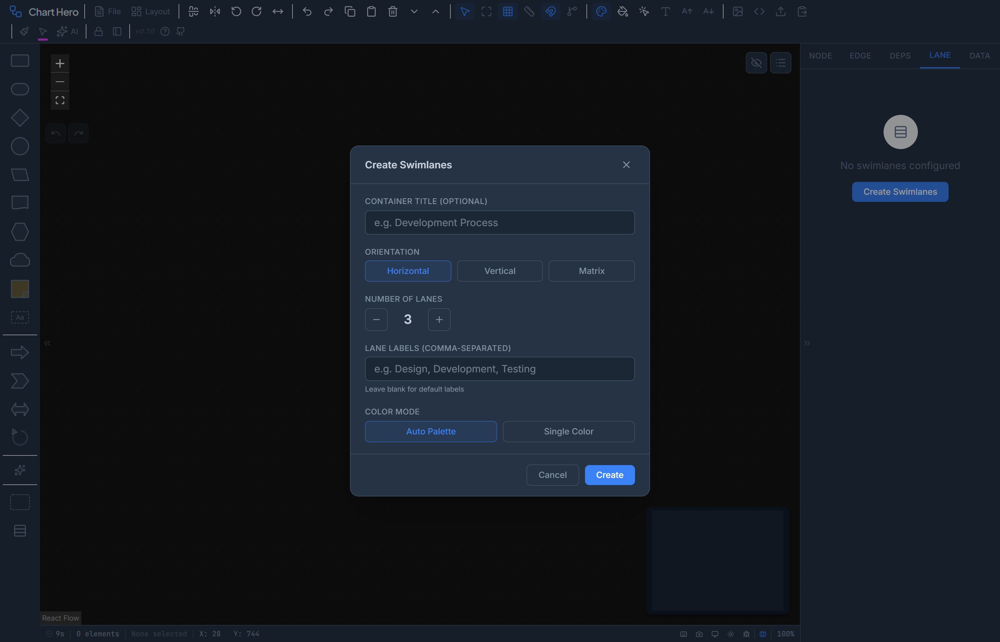

# Swimlanes & Banners

Swimlanes divide the canvas into labeled regions for organizing nodes by category, while banners add title bars above or below the diagram. Together they provide structure and context for complex workflows.

---

## Swimlanes

Swimlanes partition the canvas into horizontal rows, vertical columns, or a matrix grid. They are commonly used to group nodes by team, phase, system, responsibility, or any other category.

### Creating Swimlanes

1. Click the **Swimlanes** button in the Shape Palette (left panel), or right-click the canvas and select **Insert Swimlanes**.
2. The creation dialog appears with these options:

| Field | Description | Default |
|-------|-------------|---------|
| **Container Title** | Optional top-level title displayed above the lanes | (empty) |
| **Orientation** | Horizontal (rows), Vertical (columns), or Matrix (both) | Horizontal |
| **Number of Lanes** | How many lanes to create, adjustable with + / - buttons | 3 |
| **Lane Labels** | Comma-separated list of names (e.g., "Design, Development, Testing") | Auto-generated ("Row 1", "Row 2", etc.) |
| **Color Mode** | Auto Palette (cycles through 10 colors) or Single Color (one color picker) | Auto Palette |

3. Click **Create** to generate the swimlane container on the canvas.

The lane count range is **2 to 10** lanes. Leave the labels field blank to use default names.

### Swimlane Orientations

| Orientation | Lanes | Use Case |
|-------------|-------|----------|
| **Horizontal** | Rows stacked top to bottom | Cross-functional flowcharts (teams as rows, process flows left to right) |
| **Vertical** | Columns side by side | Phase-based workflows (phases as columns, work items flow downward) |
| **Matrix** | Both rows and columns | Responsibility assignment matrices, RACI charts, grid-based categorization |

In matrix mode, the total lane count is split between rows and columns. For example, 6 total lanes creates 3 rows and 3 columns. Labels are split accordingly: the first half applies to rows, the second half to columns.

---

### Lane Properties

Each individual lane can be configured from the Swimlanes tab in the Properties Panel (right side).

| Property | Description | Default |
|----------|-------------|---------|
| **Label** | Lane name displayed in the header area | "Row N" or "Column N" |
| **Color** | Background fill color for the lane region | Auto-assigned from palette |
| **Size** | Width in pixels (vertical lanes) or height in pixels (horizontal lanes) | 200px (rows), 250px (columns) |
| **Collapsed** | Minimize the lane to its header, hiding its content area | Off |
| **Hidden** | Completely hide the lane, its header, and all nodes assigned to it | Off |
| **Show Label** | Whether the lane label is visible on the canvas | On |
| **Show Color** | Whether the lane color indicator is visible | On |
| **Order** | Position of the lane relative to other lanes (drag to reorder) | Creation order |

### Container Properties

The swimlane container wraps all lanes and provides shared configuration.

| Property | Description | Default |
|----------|-------------|---------|
| **Title** | Container-level title text displayed above the lanes | (empty) |
| **Title Font Size** | Font size for the container title in pixels | 13px |
| **Title Color** | Text color for the container title | Auto (based on dark mode) |
| **Title Font Family** | Font used for the container title | System default |
| **Border Color** | Color of the outer container border | `#94a3b8` (slate) |
| **Border Width** | Thickness of the container border in pixels | 1px |
| **Border Style** | Line style of the container border | Solid |
| **Border Radius** | Corner rounding of the container border in pixels | 4px |
| **Divider Color** | Color of lines between lanes | Auto |
| **Divider Width** | Thickness of inter-lane dividers in pixels | 1px |
| **Divider Style** | Line style of the dividers: solid, dashed, dotted, or none | Solid |
| **H Header Width** | Width of the horizontal lane label/header area | 48px |
| **V Header Height** | Height of the vertical lane label/header area | 32px |
| **Label Font Size** | Font size for all lane labels | System default |
| **Label Rotation** | Rotation angle for lane labels in degrees | 0 |

---

### Matrix Mode

Matrix mode creates a grid with both horizontal and vertical lanes simultaneously. This is useful for:

- **Responsibility matrices** -- rows for roles, columns for tasks
- **RACI charts** -- rows for deliverables, columns for team members
- **Two-axis categorization** -- any scenario where items belong to intersecting categories

To create a matrix:

1. Open the swimlane creation dialog.
2. Select **Matrix** as the orientation.
3. Set the total lane count. Chart Hero splits the count into rows (first half, minimum 2) and columns (remaining, minimum 2).
4. Provide labels as a comma-separated list. The first portion applies to rows, the rest to columns.
5. Click **Create**.

Nodes placed at the intersection of a row and column are assigned to both lanes.

---

### Assigning Nodes to Lanes

Nodes can be assigned to lanes in several ways:

- **Drag and drop** -- Drag a node into a lane region on the canvas. The node is automatically assigned to that lane.
- **AI command** -- Tell the AI assistant, for example: "Assign the API Gateway node to the Backend lane."
- **Properties Panel** -- The Data tab for a selected node shows its current lane assignment.

When a node is assigned to a lane and that lane is hidden, the node is also hidden from the canvas.

### Resizing Lanes

Drag the border between two lanes to resize them. The adjacent lane adjusts proportionally to fill the available space. The minimum lane size is 60 pixels.

When the overall swimlane container is resized, all visible, non-collapsed lanes scale proportionally to fit the new total size.

### Reordering Lanes

Lanes can be reordered from the Swimlanes tab in the Properties Panel. Drag a lane entry up or down in the list to change its position.

### Collapsing and Hiding Lanes

- **Collapse** -- Minimizes a lane to just its header. The lane still occupies a small amount of space and its label remains visible. Nodes inside a collapsed lane are hidden but retain their lane assignment.
- **Hide** -- Completely removes the lane from the canvas, including its header, background, and all assigned nodes. Hidden lanes can be restored from the Properties Panel.

---

## Banners

Banners are horizontal bars that appear at the top or bottom of the canvas area. They are useful for diagram titles, classification markings, project names, or branding.

### Enabling Banners

Open the **Layout** dropdown in the toolbar (the auto-arrange/layout menu) and scroll to the **Banner** section. Toggle the checkboxes:

- **Top Banner** -- Adds a banner bar above the canvas
- **Bottom Banner** -- Adds a banner bar below the canvas

Both banners can be enabled simultaneously.

### Configuring Banners

Right-click on a banner to open its context menu. The menu provides controls for all banner properties:

| Property | Options | Default |
|----------|---------|---------|
| **Label** | Any text (free-form input) | (empty) |
| **Height** | 16 - 200px (slider control) | 40px |
| **Background Color** | 32-color swatch grid | `#1e293b` (dark slate) |
| **Text Color** | 8 quick-pick colors: white, off-white, dark slate, near-black, red, blue, green, amber | `#ffffff` (white) |
| **Font Family** | Inter, Arial, Calibri, Segoe UI, Georgia, Verdana, Consolas, Times New Roman | Inter |
| **Font Size** | 10, 12, 14, 16, 18, 20, 24px (button row) | 14px |

### Resizing Banners by Dragging

Each banner has a drag handle along its inner edge (the bottom edge of the top banner, the top edge of the bottom banner). Hover over this edge to see the resize cursor, then drag to adjust the height.

- **Minimum height**: 16px
- **Maximum height**: 200px

### Banner Behavior

- Banners are rendered **outside** the React Flow canvas. They physically shrink the available canvas area rather than overlaying content.
- Banner text is centered horizontally and vertically within the banner bar.
- Long text is truncated with an ellipsis to fit the banner width.
- In dark mode, the default dark slate background lightens slightly for better contrast.
- Banners are included in exports (PNG, SVG, PDF) as part of the overall diagram rendering.

---

## AI Assistant Integration

The AI assistant can create and modify both swimlanes and banners through natural language commands.

**Swimlane commands:**

- "Create 4 horizontal swimlanes labeled Design, Dev, QA, Ops"
- "Add a vertical column called Security"
- "Assign the Load Balancer node to the Infrastructure lane"
- "Hide the Testing lane"
- "Set the container title to Release Pipeline"

**Banner commands:**

- "Add a top banner that says Project Alpha"
- "Enable both banners"
- "Set the top banner background to navy blue"

---

## Tips

- **Use swimlanes for stakeholder communication** -- Lanes labeled with team names immediately show who owns each step in a process.
- **Matrix mode for RACI charts** -- Create a matrix with rows for deliverables and columns for roles, then place nodes at intersections to indicate Responsible, Accountable, Consulted, or Informed.
- **Classification banners** -- Defense and government diagrams often require classification markings. Use a red top banner with white text for "UNCLASSIFIED" or other markings.
- **Color-code lanes to match nodes** -- Set auto-color mode to "By Lane" (in the style controls) so node fills automatically match their swimlane color, creating a strong visual grouping.
- **Collapse lanes you are not working on** -- Collapsing inactive lanes saves screen space while keeping the diagram structure intact.
