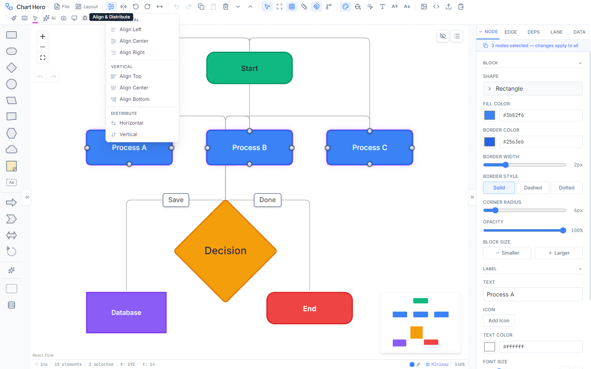
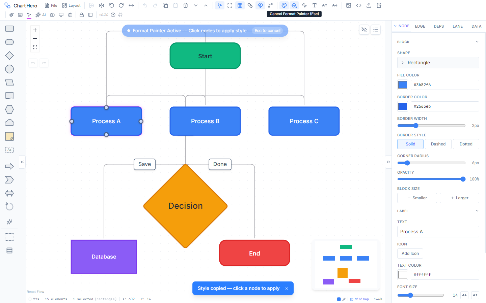
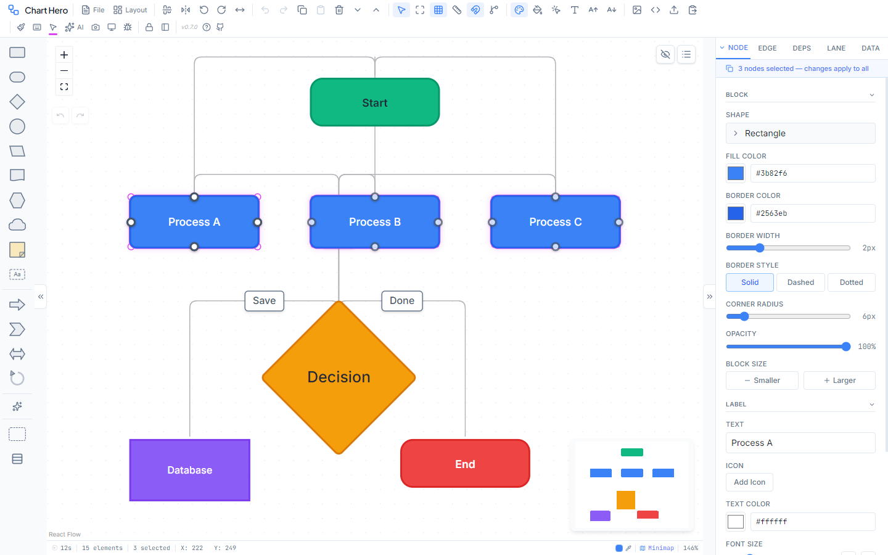

# Toolbar Reference

Complete reference for every toolbar button in Chart Hero. The toolbar sits at the top of the window by default (or along the left edge in vertical orientation). Button groups can be reordered by dragging when the toolbar is unlocked.

**Toolbar Controls** (pinned to the far right, always visible):

| Control | Description |
|---------|-------------|
| Lock / Unlock | Toggle drag-reordering of button groups |
| Orientation | Switch between horizontal and vertical toolbar layout |

---

## File Group

| Button | Icon | Shortcut | Action |
|--------|------|----------|--------|
| File | FileText | -- | Opens the File dropdown menu |

**File Dropdown**

- **New Diagram** -- Clear the canvas and reset swimlanes, legends, banners, and dependencies. Prompts for confirmation if the canvas is not empty.
- **Open (.fc)** -- Load a `.fc` or `.json` diagram file from disk.
- **Save (.fc)** -- `Ctrl+S` -- Export the full diagram state (nodes, edges, swimlanes, styles, viewport) as a `.fc` file.
- **Templates** -- Open the template gallery. Categories: General, Business, Software, Agile.
- **Install as App** -- Install Chart Hero as a PWA desktop application. Grayed out when the browser does not support installation or the app is already installed.

---

## Layout Group

| Button | Icon | Shortcut | Action |
|--------|------|----------|--------|
| Layout | LayoutDashboard | -- | Opens the Layout dropdown menu |

**Layout Dropdown**

- **Auto Arrange** -- `Ctrl+Shift+L` -- Run the Dagre layout algorithm top-to-bottom.
- **Vertical Layout** -- Hierarchical top-to-bottom arrangement (same as Auto Arrange).
- **Horizontal Layout** -- Hierarchical left-to-right arrangement.

**Banner Section** (inside the Layout dropdown)

- **Top Banner** -- Toggle a colored banner bar across the top of the canvas. Configure label, color, font, and height in the banner settings.
- **Bottom Banner** -- Toggle a colored banner bar across the bottom of the canvas.

---

## Arrange Group

Most buttons in this group require one or more selected nodes.

| Button | Icon | Shortcut | Action |
|--------|------|----------|--------|
| Align and Distribute | AlignCenterHorizontal | -- | Opens the alignment dropdown (requires 2+ selected nodes) |
| Flip | FlipHorizontal2 | -- | Opens the flip dropdown (requires 1+ selected nodes) |
| Rotate Left | RotateCcw | -- | Rotate counter-clockwise. Long-press to set a custom angle. |
| Rotate Right | RotateCw | -- | Rotate clockwise. Long-press to set a custom angle. |
| Straighten Edges | MoveHorizontal | `Ctrl+Alt+S` | Auto-position nodes so connectors become straight lines |

**Align and Distribute Dropdown** (2+ nodes selected)

| Section | Options |
|---------|---------|
| Horizontal | Align Left, Align Center, Align Right |
| Vertical | Align Top, Align Center, Align Bottom |
| Distribute (3+ nodes) | Distribute Horizontal, Distribute Vertical |

**Flip Dropdown**

| Option | Shortcut |
|--------|----------|
| Horizontal | `Ctrl+Shift+H` |
| Vertical | `Ctrl+Alt+V` |

Flipping mirrors the shape visually. When two or more nodes are selected, their positions are also mirrored around the group center.

**Rotation**

The default rotation increment is 15 degrees. Long-press (hold for 500 ms) either rotate button to open a popover where you can type a custom angle increment in degrees. The custom value persists until you change it again.

---

## Edit Group

| Button | Icon | Shortcut | Action |
|--------|------|----------|--------|
| Undo | Undo2 | `Ctrl+Z` | Undo the last action (up to 50 levels) |
| Redo | Redo2 | `Ctrl+Shift+Z` | Redo the last undone action |
| Copy | Copy | `Ctrl+C` | Copy the current selection to the clipboard |
| Paste | Clipboard | `Ctrl+V` | Paste from the clipboard |
| Delete | Trash2 | `Delete` | Remove selected nodes and their connected edges |
| Send Backward | ChevronDown | `Ctrl+[` | Move selected nodes back one z-layer |
| Bring Forward | ChevronUp | `Ctrl+]` | Move selected nodes forward one z-layer |

---

## View Group

| Button | Icon | Shortcut | Action |
|--------|------|----------|--------|
| Select Tool | MousePointer2 | -- | Default selection mode (always active) |
| Fit View | Maximize | -- | Zoom and pan to fit all content in the viewport |
| Grid Options | Grid3X3 | -- | Opens the grid configuration dropdown |
| Ruler | Ruler | -- | Toggle measurement rulers along the top and left edges |
| Snap Options | Magnet | -- | Opens the snap configuration dropdown |
| Dependency Badges | GitBranch | -- | Toggle dependency badge overlay on nodes |

**Grid Options Dropdown**

| Setting | Values |
|---------|--------|
| Visibility | Show Grid / Hide Grid |
| Style | Dots, Lines, Cross |
| Size | 10px, 20px, 40px, 80px |

**Snap Options Dropdown**

| Setting | Values |
|---------|--------|
| Snap toggle | Enable Snap / Disable Snap |
| Distance | 4px, 8px, 16px, 32px |

---

## Panels Group

| Button | Icon | Shortcut | Action |
|--------|------|----------|--------|
| Properties Panel | Palette | -- | Toggle the right-side properties panel |
| Format Painter | PaintBucket | -- | Copy and apply visual formatting between elements |
| Select Same Type | MousePointerClick | -- | Select every node of the same shape (or every edge of the same type) as the current selection |
| Global Font | Type | -- | Opens a font picker dropdown with 25+ fonts in 4 categories |
| Increase Font | AArrowUp | -- | Increase font size on all nodes by 2px (also scales node dimensions proportionally) |
| Decrease Font | AArrowDown | -- | Decrease font size on all nodes by 2px (also scales node dimensions proportionally) |

**Format Painter**

| Click mode | Behavior |
|------------|----------|
| Single click | Copies the style from the selected node or edge, applies it to the next element you click, then deactivates automatically. |
| Double click | Persistent mode. Keeps applying the copied style to every element you click until you press `Escape` or click the button again to deactivate. |

The Format Painter copies these properties: fill color, border color, text color, font size, font weight, font family, border style, border width, border radius, opacity, and text alignment.

**Select Same Type**

**Font Picker Categories**

| Category | Fonts |
|----------|-------|
| Sans-Serif | Inter, Aptos, Calibri, Segoe UI, Arial, Helvetica, Verdana, Tahoma, Trebuchet MS, Franklin Gothic, Franklin Gothic Book, Century Gothic, Candara, Corbel, Gill Sans MT, Lucida Sans |
| Serif | Cambria, Georgia, Times New Roman, Garamond, Palatino, Book Antiqua, Constantia |
| Monospace | Consolas, Courier New |
| Display | Impact, Arial Black, Comic Sans MS |

---

## Export Group

| Button | Icon | Shortcut | Action |
|--------|------|----------|--------|
| Copy as Image | Image | -- | Copy the diagram as a PNG image to the system clipboard |
| Copy SVG | Code | -- | Opens a dropdown with two SVG copy modes |
| Export | Upload | `Ctrl+Shift+E` | Open the full export dialog (PNG, JPG, SVG, PDF, PPTX, JSON) |
| Import JSON | ClipboardPaste | -- | Open the JSON import dialog |

**Copy SVG Dropdown**

| Option | Description |
|--------|-------------|
| Copy Raw Code | Copies the SVG markup as text to the clipboard |
| Copy for PPT | Copies the SVG in a format optimized for pasting into PowerPoint or Google Slides |

---

## Pinned Utilities

These buttons are always visible at the far right (or bottom in vertical mode) and cannot be reordered.

| Button | Icon | Shortcut | Action |
|--------|------|----------|--------|
| Style and Palette | Paintbrush | -- | Open the style picker overlay (19 diagram styles + 11 color palettes) |
| Shortcuts | Keyboard | `Ctrl+/` | Open the keyboard shortcuts reference dialog |
| Selection Color | MousePointer2 + color swatch | -- | Choose the selection highlight color (10 colors) and border thickness (1--4px) |
| Live Collaboration | Users | -- | Open the collaboration panel to create or join a room |
| AI Assistant | Sparkles | `Ctrl+Shift+A` | Toggle the AI chat panel |
| Screenshot | Camera | -- | Enter screenshot region selection mode |

**Live Collaboration**

Click the Users icon to open the collaboration panel. From here you can:

- **Start New Session** -- create a room with a unique link to share
- **Join Session** -- paste a room link or ID to join an existing room
- **View connected users** -- see who's in the room with colored avatars
- **Edit your name** -- hover your name and click the pencil icon
- **Leave Session** -- disconnect and return to solo editing

When collaborating, a green dot appears on the icon and colored user avatars display next to the button. Join/leave notifications briefly appear below the icon. See [Live Collaboration](collaboration.md) for full details.
| Presentation | Monitor | -- | Enter fullscreen presentation mode (hides all UI) |
| Debug | Bug | -- | Toggle debug logging to the browser console |
| Lock Toolbar | Lock / Unlock | -- | Lock or unlock toolbar group reordering |
| Orientation | PanelTop / PanelLeft | -- | Switch between horizontal and vertical toolbar layout |
| Version | -- | -- | Displays the current Chart Hero version (read-only, horizontal mode only) |
| User Guide | HelpCircle | -- | Opens the user guide in a new browser tab (horizontal mode only) |
| GitHub | Github | -- | Opens the Chart Hero GitHub repository in a new tab (horizontal mode only) |

---

## Toolbar Customization

**Reordering groups**

1. Click the **Unlock** button (lock icon) in the pinned utilities area.
2. Drag handles appear to the left of each button group.
3. Drag a group handle and drop it onto another group to swap positions.
4. Click **Lock** when you are satisfied with the arrangement.

The custom order is saved in your browser and persists across sessions.

**Switching orientation**

Click the orientation toggle button in the pinned utilities area. In vertical mode the toolbar renders as a narrow column along the left edge of the screen, and tooltips appear to the right of each button.
